```{r xaringan-themer, include = FALSE}
library(xaringanthemer)
mono_accent(base_color = "#bf67bc") #3E8A83?
```

```{r, include = FALSE}
library(tidyverse)
library(mosaic)
library(datasauRus)
library(correlation)
knitr::opts_chunk$set(warning = FALSE, message = FALSE, 
                      echo = TRUE, dpi = 300, tidy = "styler")
```

<!--
pagedown::chrome_print("~/Dropbox/Teaching/03-Simmons Courses/MATH228-Introduction to Data Science/Lecture Slides/01-Introduction/01-Introduction.html")
-->

# Module Plan

- **Case studies**
    - Spotify data!

--

- **Data basics**
    - Datasets (in R)
    - Types of variables
    - Relationships between variables

--

- **Sampling strategies**
    - Observational studies
    - Sampling design

--

- **Experimental design**
    - Association: What does it mean?
    - Randomization
    - Blocking

---

class: center, middle

# Case Studies

---

# Jam Session

[Spotify data](https://github.com/rfordatascience/tidytuesday/blob/master/data/2020/2020-01-21/readme.md)

- A *sample* of 10,458 songs from Spotify

- Songs categorized as either **rock** or **pop**

```{r, echo = FALSE}
spotify_songs <- read_csv('https://raw.githubusercontent.com/rfordatascience/tidytuesday/master/data/2020/2020-01-21/spotify_songs.csv')
spotify_songs %>%
  select(track_artist, playlist_genre, danceability) %>%
  filter(playlist_genre %in% c("rock", "pop")) 
```

--

**Question**: Is there a *relationship* between `genre` and `danceability`?

---

# Explortatory Data Analysis

**Summary statistics**

```{r, echo = FALSE}
spotify_songs %>%
  select(track_artist, playlist_genre, danceability) %>%
  filter(playlist_genre %in% c("rock", "pop")) %>%
  group_by(playlist_genre) %>%
  summarize(mean_dance = mean(danceability), 
            sd_dance = sd(danceability),
            median_dance = median(danceability))
```

--

**Data visualization**

```{r, echo = FALSE, out.width = "65%", fig.width = 8, fig.height = 5}
spotify_rp = spotify_songs %>%
  select(track_name, track_artist, playlist_genre, danceability) %>%
  filter(playlist_genre %in% c("rock", "pop"))

bwplot(danceability ~ playlist_genre, data = spotify_rp)
```

---

# Remarks

.pull-left[
```{r, echo = FALSE}
bwplot(danceability ~ playlist_genre, data = spotify_rp)
```
]

.pull-right[
It *appears* that **pop** songs tend to have *higher* measures of "danceability" compared to **rock** songs. 

- Is the difference **large enough**?

- Is the result **generalizable**?
    - Is the sample *representative*?
]

---

class: center, middle

# Data Basics

---

# What is data?

**Data** are any collection of numbers, characters, images, or other items that provide information about something.
- Datasets are made up of **variables** measured on **cases**

--

```{r, echo = FALSE}
spotify_songs %>%
  select(track_name, track_artist, playlist_genre, danceability)
```

--

**Cases**: individual songs

--

**Variables**: `track_name`, `track_artist`, `playlist_genre`, `danceability`

---

# Data Sources

Knowing where the data come from is important!

--

- Many of the datasets I'll use in this class come from [TidyTuesday](https://github.com/rfordatascience/tidytuesday). 

.center[
```{r, echo = FALSE}
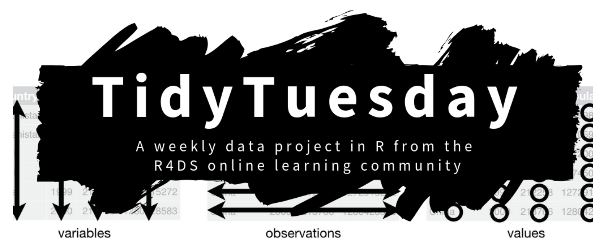
```
]

--

Most **TidyTuesday** datasets contain a *data dictionary*, so you can determine what each of the **variables** mean!

---

# Types of Variables: Categorical

**Categorical (Qualitative) Variables**

- **Nominal**: We classify individuals into categories; *no intrinsic order* to the categories.
    - Examples: state/country, eye color, college major
    
--

- **Ordinal**: We classify individuals into categories; categories have *a natural ordering*.
    - Examples: class on airplane, letter grade
    
--

Which variables in the **Spotify data** are **categorical**?

```{r, echo = FALSE}
spotify_songs %>%
  select(track_name, track_artist, playlist_genre, danceability) %>%
  head(5)
```

---

# Types of Variables: Numerical

**Numerical (Quantitative) Variables**

- **Discrete**: Numerical variable that can *only take whole, non-negative numbers* (0, 1, 2, ...)
    - Examples: number of students in STAT 118, number of heads when flipping 3 coins. 
    
--

- **Continuous**: Numerical variable that can *take an infinite range of numbers* within a (sometimes infinite) interval.     
    - Examples: age, temperature, height, weight

--

Which variables in the **Spotify data** are **numerical**?

```{r, echo = FALSE}
spotify_songs %>%
  select(track_name, track_artist, playlist_genre, danceability) %>%
  head(5)
```

---

# Relationships Between Variables

**Some examples...**

Motivated by [TidyTuesday](https://github.com/rfordatascience/tidytuesday) data:

- Are [hotel bookings](https://github.com/rfordatascience/tidytuesday/blob/master/data/2020/2020-02-11/readme.md) with or without *children* **associated** with *month*?
    - Two **categorical** variables
    
--

- Is [password](https://github.com/rfordatascience/tidytuesday/blob/master/data/2020/2020-01-14/readme.md) *strength* **associated** with *category*?
    - One **numerical** variable, one **categorical** variable
    
--

- Is *cholesterol* in [fast food menu items](https://github.com/rfordatascience/tidytuesday/tree/master/data/2018/2018-09-04) **associated** with *calories*?
    - Two **numerical** variables
    
---

# More Data!

.pull-left[
```{r, echo = FALSE}
my_data = datasaurus_dozen %>%
  filter(dataset == "dino") %>%
  select(x, y)
```
```{r}
head(my_data, 10)
```
]

--

.pull-right[
```{r}
mean( ~ x, data = my_data)
mean( ~ y, data = my_data)
cor(x ~ y, data = my_data)
```
]

--

**Weak correlation** between *x* and *y* - what's going on?!

---

# More Data Visualizations

The **Datasaurus Dozen**


---

# We need more than raw data!

Each *x* and *y* in these graphs has the same **mean**, **standard deviation**, **variance**, and **correlation**!

.center[
```{r, echo = FALSE}
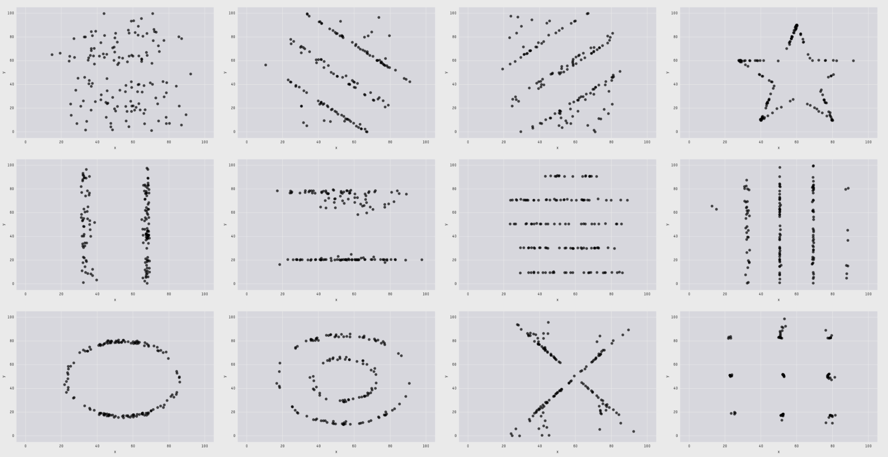
```
]

---

# Another Example

What is the association between *x* and *y*?

.center[
```{r, echo = FALSE, out.width = "65%"}
set.seed(12)
my_data = simulate_simpson(n = 100, groups = 5, r = 0.5)
my_data = my_data %>%
  rename(x = V1, y = V2)
ggplot(my_data, aes(x = x, y = y)) + 
  geom_point(alpha = 0.7) + 
  geom_smooth(method = "lm", se = FALSE) + 
  theme_bw()
```
]

---

# The SAME Example!

**Now** what is the association between *x* and *y*?

.center[
```{r, echo = FALSE, out.width = "65%"}
set.seed(12)
my_data = simulate_simpson(n = 100, groups = 5, r = 0.5)
my_data = my_data %>%
  rename(x = V1, y = V2)
ggplot(my_data, aes(x = x, y = y, color = Group)) + 
  geom_point(alpha = 0.7) + 
  geom_smooth(method = "lm", se = FALSE) + 
  theme_bw()
```
]

---

class: center, middle

# Sampling Strategies

---

# Observational Studies

One primary type of data collection is through an **observational study**. 

- Data collected through *surveys*, *medical records*, following a *cohort* of similar individuals, etc.

- Researchers merely *observe* the data. 

--

.center[
```{r, echo = FALSE, out.width = "60%"}

```
]

--

**Research question**: What is the relative **safety**, in terms of *risk of cardiovascular disease*, of various treatments for type 2 diabetes?

---

# Sampling from a population

This research question uses a **sample** to reach conclusions about a target **population**. 

--

**General principle**: A **sample** from a **population** is useful for learning about a population only when the sample is **representative** of the population. 

- **Random** sampling is key!

- How might sampling be *non-representative*?

--

.center[
```{r, echo = FALSE, dpi = 200}
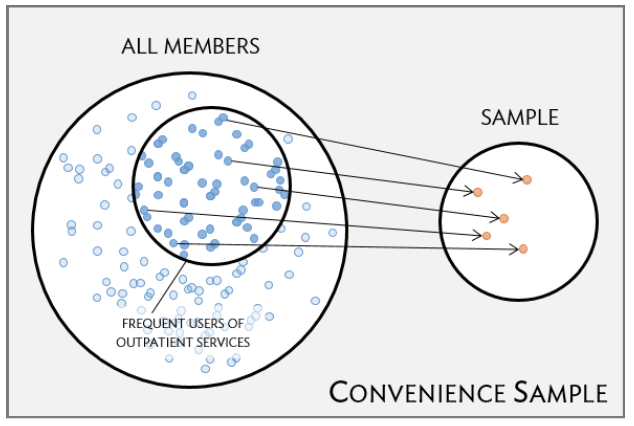
```
]

---

# Sampling from a population

This research question uses a **sample** to reach conclusions about a target **population**. 

--

**General principle**: A **sample** from a **population** is useful for learning about a population only when the sample is **representative** of the population. 

- **Random** sampling is key!

- How might sampling be *non-representative*?

--

.center[
```{r, echo = FALSE, dpi = 200}
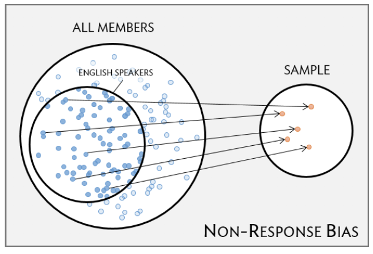
```
]

---

# Simple Random Sampling

.center[
```{r, echo = FALSE, dpi = 200}
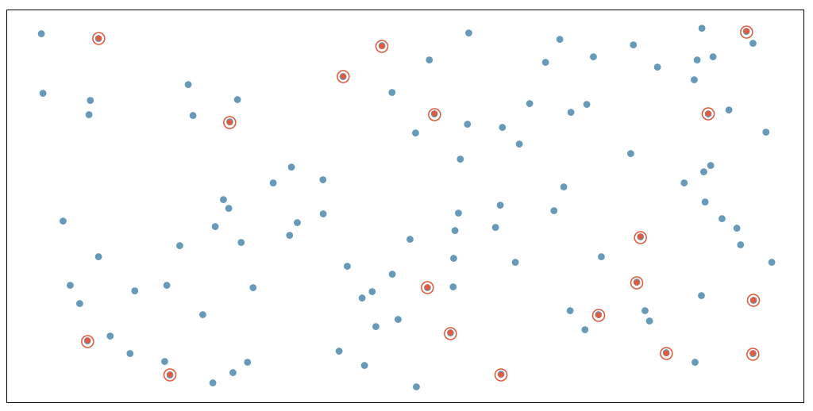
```
]

- **Note**: Not *guaranteed* to be **representative** (e.g., if most people don't respond)

---

# Stratified Sampling

.center[
```{r, echo = FALSE, dpi = 200}
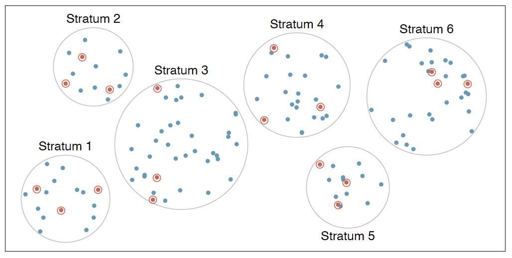
```
]

- Population first divided into **strata**. Cases within each stratum are **similar**. 

--

**Example**: Sampling from health care providers in *different cities*

---

# Cluster Sampling

.center[
```{r, echo = FALSE, dpi = 200}
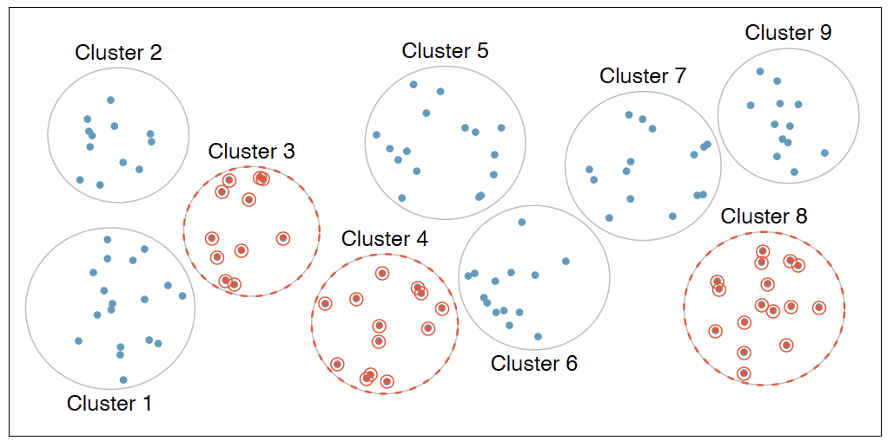
```
]

- There *might* be **variability** within clusters, but the clusters themselves are similar. 

--

**Example**: Sampling from neighborhoods in a city. 
- The population within each neighborhood might be *diverse*, but overall the neighborhoods are relatively *similar*. 

---

# Multistage Sampling

.center[
```{r, echo = FALSE, dpi = 200}
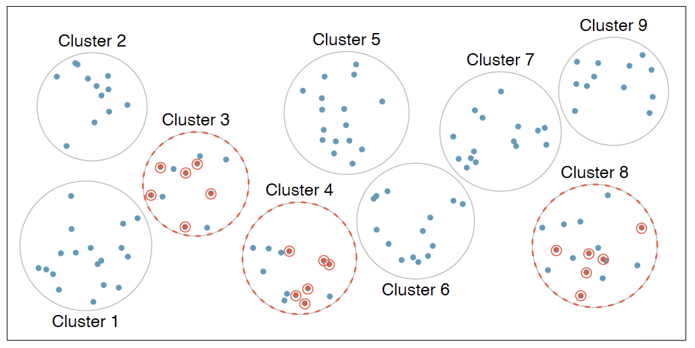
```
]

- Similar to **cluster sampling**, except take a *simple random sample* within each cluster. 

---

class: center, middle

# Experiments

---

# Chocolate Consumption and Nobel Laureates?

[Source](https://www.nejm.org/doi/full/10.1056/NEJMon1211064)

.center[
```{r, echo = FALSE, dpi = 200}
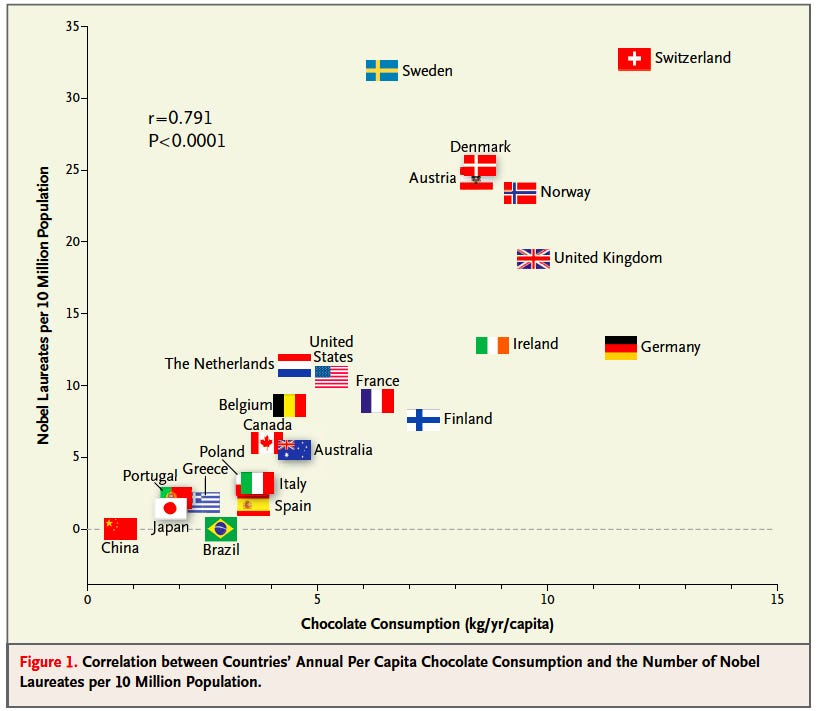
```

]

- **Conclusion**: There is an **association** between chocolate intake per capita and the number of Nobel laureates in various countries.

---

# Three Possible Explanations

- Higher chocolate intake (*x*) causes an increase in chances of winning the Nobel Prize (*y*). 

.center[
```{r, echo = FALSE}
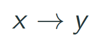
```
]

--

- Winning the Nobel Prize (*y*) causes an increase in chocolate intake (*x*). 

.center[
```{r, echo = FALSE}
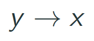
```
]

--

- A *third variable* is responsible for both *x* and *y*. This is called a **confounder**. 
    - **Examples**: differences in socioeconomic status between countries, geographic and climatic factors, etc.

.center[
```{r, echo = FALSE}
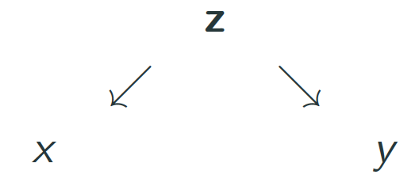
```
]

--

(This is **not** an experiment!)

---

# Experiments

In **experiments** (often referred to as *randomized trials*), researchers assign *treatments* to cases in a sample.
- Can establish a **causal connection** between the *treatment* and *outcome*

--

[Learning Early About Peanuts (LEAP) Study](https://www.nejm.org/doi/pdf/10.1056/NEJMoa1414850)

.center[
```{r, echo = FALSE}

```
]

---

# Principle 1: Control

When selecting participants for a study, researchers work to **control** for extraneous variables (confounders) and choose a sample of participants that is *representative* of the population of interest. 

--

.center[
```{r, echo = FALSE, dpi = 200}
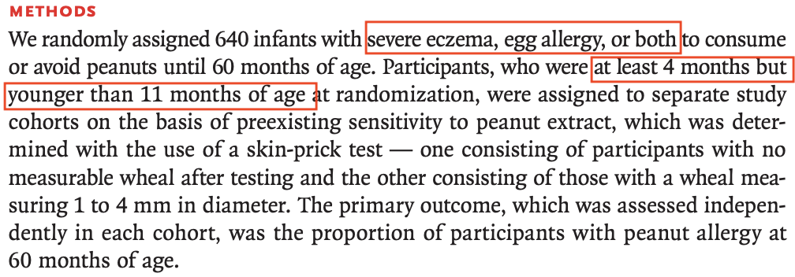
```
]

**Inclusion criteria**: (1) between 4 and 11 months of age, (2) severe eczema and/or allergies to eggs

---

# Principle 2: Randomization

**Randomly assign** patients to *treatment groups*. 

- Ensures that groups are **balanced** with respect to potential confounders. 

- Differences in outcome between treatment groups can be directly attributed to the *treatment*. 

--

.center[
```{r, echo = FALSE, dpi = 200}
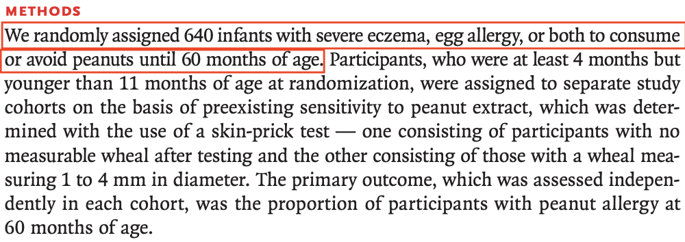
```
]

--

If researchers suspect that variables *other than the treatment* may influence the response... 
- Group into **blocks** based on said variables, and *randomize within each block*. 

---

# Principle 3: Replication

Results from a study with a *larger number of cases* are generally more **reliable**. 

- LEAP study: $n = 640$

--

.center[
```{r, echo = FALSE, dpi = 200}

```
]

--

**Randomized experiments** are *essential*, and are often required for a new drug or vaccine to be marketed to the public. 

