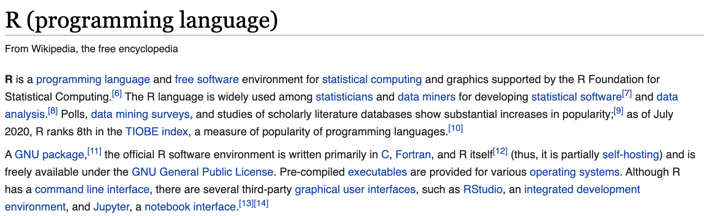
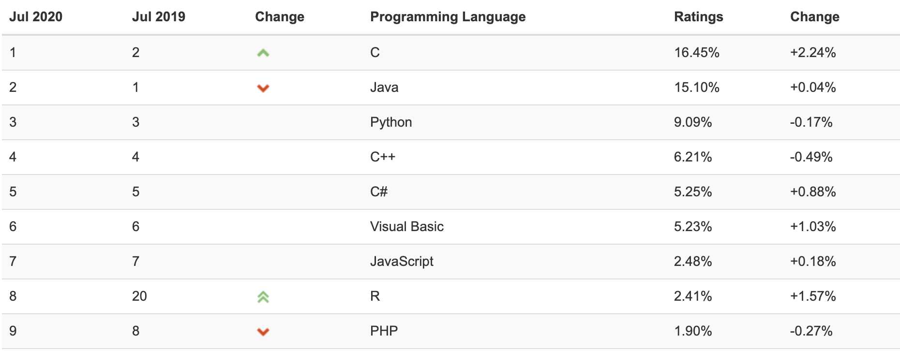
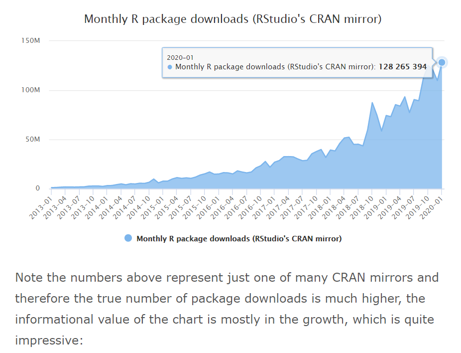
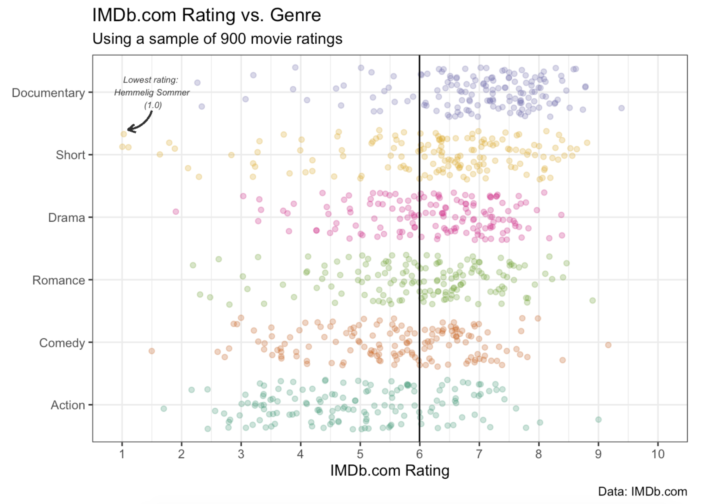
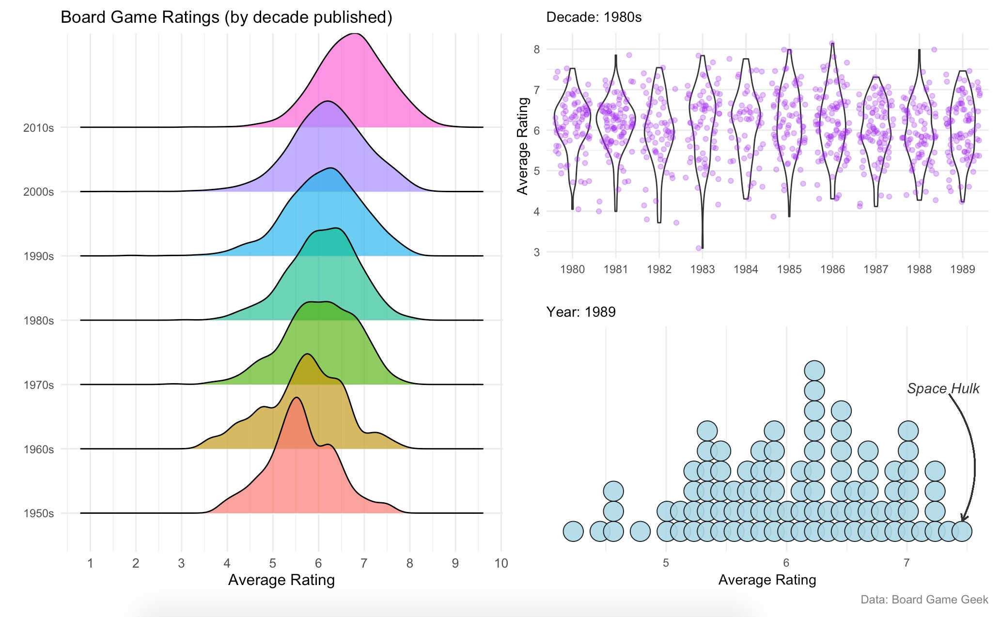
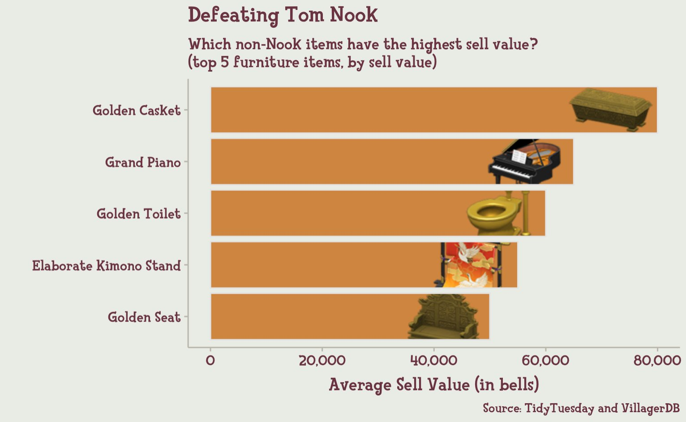
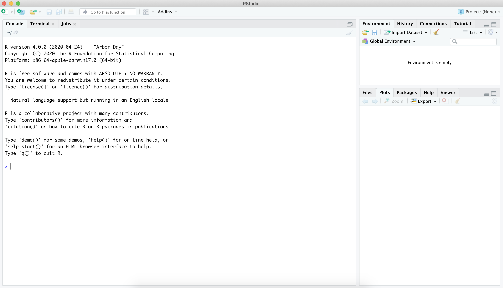
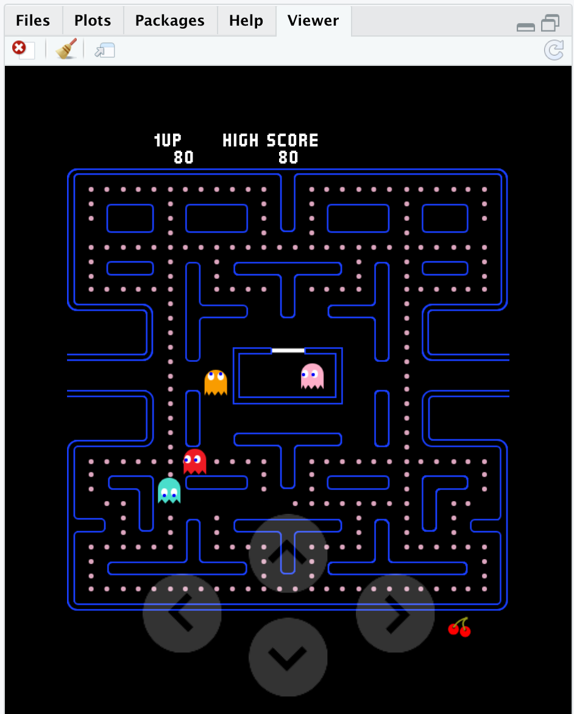
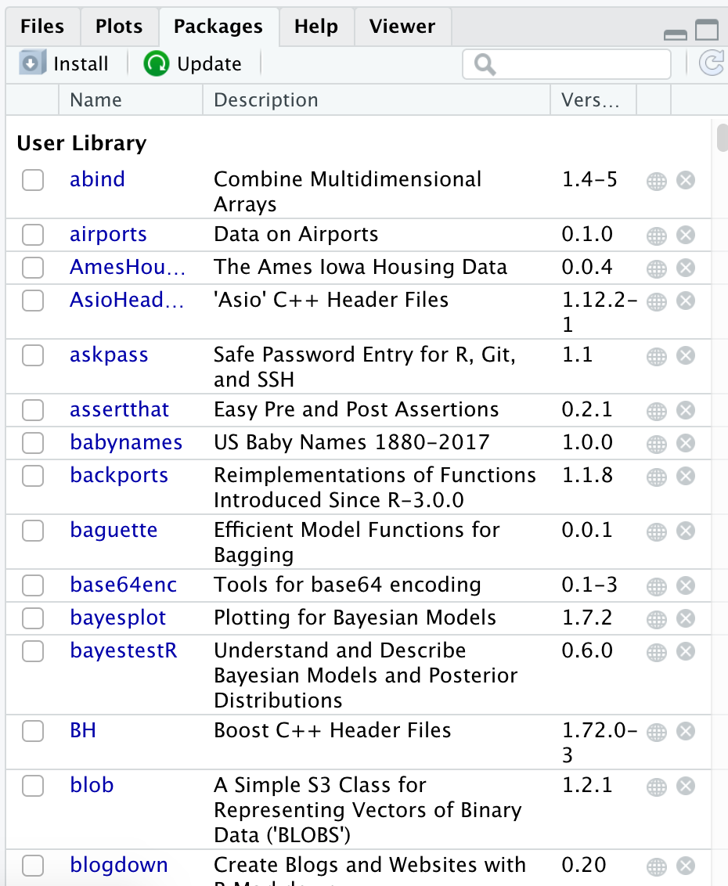
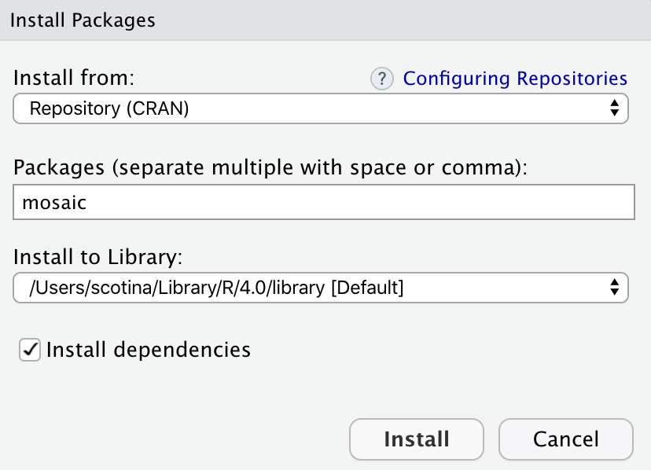

```{r xaringan-themer, include = FALSE}
library(xaringanthemer)
mono_accent(base_color = "#bf67bc") #3E8A83?
```

```{r, include = FALSE}
library(tidyverse)
library(mosaic)
library(nycflights13)
knitr::opts_chunk$set(warning = FALSE, message = FALSE, 
                      echo = TRUE, dpi = 250, tidy = "styler")
```

<!--
pagedown::chrome_print("~/Dropbox/Teaching/03-Simmons Courses/MATH228-Introduction to Data Science/Lecture Slides/01-Introduction/01-Introduction.html")
-->

class: center, middle, frame

# Module Plan

## What is .display[R]?

--

## Why .display[R] for doing Statistics?

--

## Some .display[basics]

---

class: center, middle, frame

# What is R?

---

# What is R?

🤔🤔🤔

.center[
```{r, echo = FALSE}

```
]

---

# What is R?

🤔🤔🤔

.center[
```{r, echo = FALSE}

```
]

--

**R** is a programming language designed originally for *statistical analysis*. 

- Created by **Ross Ihaka** and **Robert Gentleman** in 1993. 

- Formally released by the **R Core Group** in 1997. 

---

# Why R?

R is *popular*, and **growing**!

.center[
```{r, echo = FALSE}

```
]

- [TIOBE index, July 2020](https://www.tiobe.com/tiobe-index/)

---

# Why R?

R is *popular*, and **growing**!

.center[
```{r, echo = FALSE, dpi = 200}

```
]

---

class: center, middle, frame

# Why R for doing Statistics?

---

# R's Strengths

Handling data with different **types** of variables
    
- **numerical** or **categorical**, but also *time*, *location* (longitude/latitude), *text*-based data, etc.
    
.center[
```{r, echo = FALSE}
flights_data = flights %>%
  select(year, month, day, sched_dep_time, dep_delay, carrier, dest) %>%
  na.omit()
head(sample_n(flights_data, 10))
```
]
    
---

# R's Strengths

Making nice and complex **data visualizations**

- and **customizable** - Make a visualization yours!
    
.center[
```{r, echo = FALSE, dpi = 350}

```
]

---

# R's Strengths

Making nice and complex **data visualizations**

- and **customizable** - Make a visualization yours!
    
.center[
```{r, echo = FALSE, dpi = 350}

```
]

---

# R's Strengths

Making nice and complex **data visualizations**

- and **customizable** - Make a visualization yours!
    
.center[
```{r, echo = FALSE, dpi = 350}

```
]

---

# R's Strengths

Most importantly, R is **open-source**. 

- There is no company that *owns* R, like there is for, say, Microsoft Excel. 

- Different R *packages* are written by **users**, like you and me!

--

<br> 

**You can download R and RStudio anytime you want, for free!** 

- **R**: [https://www.r-project.org/](https://www.r-project.org/)

- **RStudio**: [https://rstudio.com/](https://rstudio.com/)

(or just use [rstudio.simmons.edu](https://rstudio.simmons.edu/auth-sign-in), for now)

---

# Why R in STAT 118?

**STAT 118** is a course in [**modern**] *Introductory Statistics*. 

Two major goals are:

1. Understand data and be able to *communicate* results

2. **Do statistics**

--

Less of... $$s = \sqrt{\frac{1}{n-1}\sum_{i=1}^{n}(x_{i}-\bar{x})^{2}}$$

More of...

```{r}
sd( ~ dep_delay, data = flights_data)
```

---

class: center, middle, frame

# Some Basics

---

# What is RStudio?

**RStudio** is an IDE (*Integrated Developer Environment*)

- This basically means that RStudio is an *application* that makes it easier for you to interact with R. 

--

.center[
```{r, echo = FALSE}
knitr::include_graphics("r_vs_rstudio.png")
```
]

- Released in 2011 by J.J. Allaire

---

# What is RStudio?

.center[
```{r, echo = FALSE}

```
]

---

# R Packages

A strength of **open-source** material is that you can freely share it (e.g., code) with other users!

- You can also *create* R packages, which are extra sets of code that add **new functionality** to R when installed. 

--

<br>

.center[
```{r, echo = FALSE, dpi = 250}
knitr::include_graphics("app.jpg")
```
]

---

# Some Example R Packages

[mosaic](https://www.rdocumentation.org/packages/mosaic/versions/1.7.0)

- Functions used to simplify some of the R in Introductory Statistics courses

--

[openintro](https://www.openintro.org/)

- Contains **datasets** used in the *OpenIntro* textbook

--

[tidyverse](https://www.tidyverse.org/)

- A *suite of packages* for **Data Science** with a common underlying framework

.center[
```{r, echo = FALSE, dpi = 350}
knitr::include_graphics("tidyverse_hex.png")
```
]

---

# Other Example R Packages...

[Rcade](https://github.com/RLesur/Rcade)

.center[
```{r, echo = FALSE, dpi = 350}

```
]

---

# Other Example R Packages...

[pupR](https://github.com/melissanjohnson/pupR)

```{r, echo = FALSE}
set.seed(118)
```

```{r, warning = FALSE, message = FALSE, dpi = 400, out.width = "50%"}
library(pupR)
pupR()
```

---

# R Packages in STAT 118

If you're using [rstudio.simmons.edu](https://rstudio.simmons.edu/auth-sign-in), you might have essential packages for the course already installed!

- Otherwise, you'll need to **install** them, but it's painless to do so!

--

**To install**:

.pull-left[
```{r, echo = FALSE}

```
]

--

.pull-right[
```{r, echo = FALSE}

```
]

---

# Time for some R!

**Let's go try it!**

<br>
<br>
]
.center[
```{r, echo = FALSE, dpi = 100}
knitr::include_graphics("rstudio.png")
```
]


