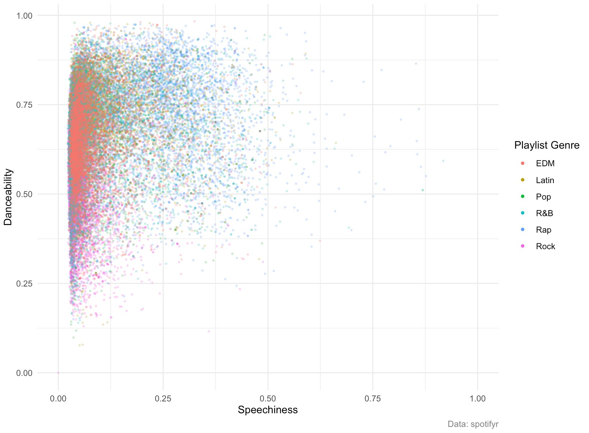
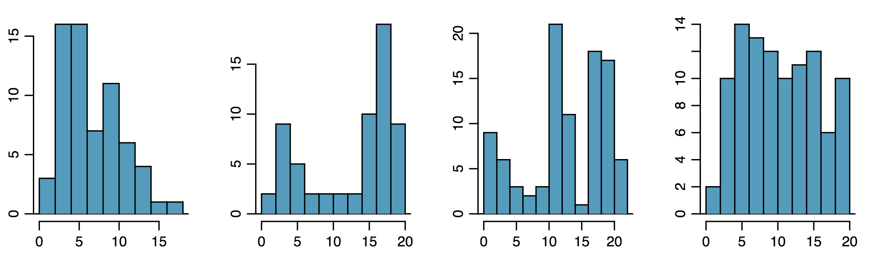
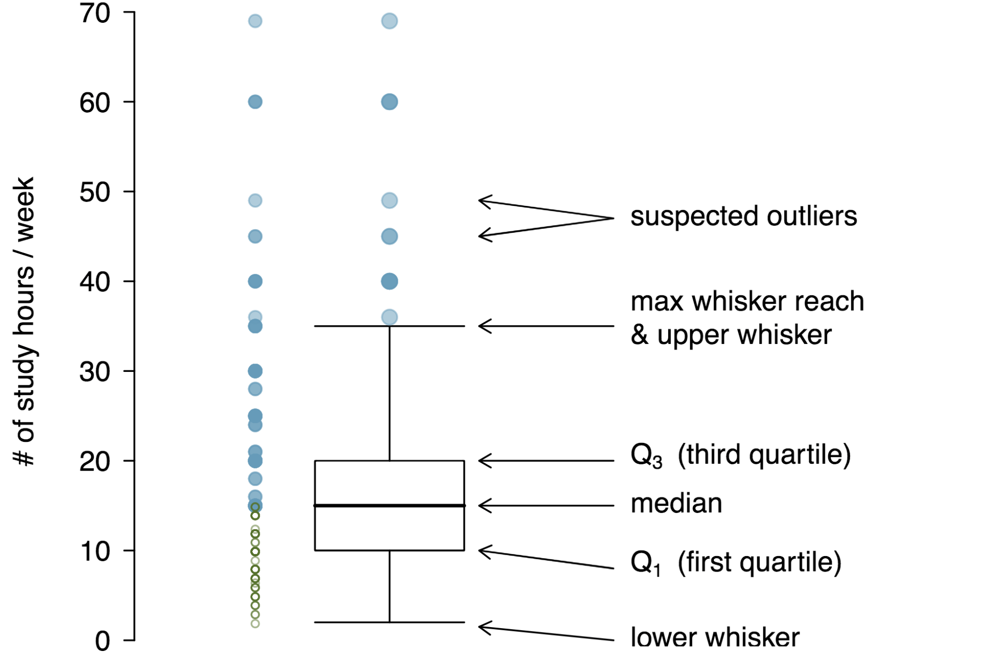

```{r xaringan-themer, include = FALSE}
library(xaringanthemer)
mono_accent(base_color = "#bf67bc") #3E8A83?
```

```{r, include = FALSE}
library(tidyverse)
library(mosaic)
library(oibiostat)
knitr::opts_chunk$set(warning = FALSE, message = FALSE, 
                      echo = TRUE, dpi = 300)

#spotify_songs <- read_csv('https://raw.githubusercontent.com/rfordatascience/tidytuesday/master/data/2020/2020-01-21/spotify_songs.csv')
```

<!--
pagedown::chrome_print("~/Dropbox/Teaching/03-Simmons Courses/MATH228-Introduction to Data Science/Lecture Slides/01-Introduction/01-Introduction.html")
-->

# Module Plan

- **Examining numerical data**
    - Data visualization
    
--

- **Measures of center and spread**
    - Mean/median, standard deviation/IQR
    
--

- **Robust statistics**
    - Comparing measures of center and spread

--

- **Examining categorical data**
    - Contingency tables (and how to read them)
    
    - Data visualization

---

class: center, middle

# Examining Numerical Data

---

# Data Visualization: What is it?

> "The simple graph has brought more information to the data analyst’s mind 
> than any other device." -- John Tukey

**What information?**

--

- presence of **outliers**

- **distributions** (of individual variables)

- **relationships** (between groups of variables)

--

.center[
**Patterns** in data!
]

---

# Scatterplots

```{r, echo = FALSE}
airbnb_boston <- read_csv("~/Dropbox/Teaching/03-Simmons Courses/STAT118-Introductory Statistics [ONLINE]/Data/airbnb_boston.csv")
airbnb_boston = airbnb_boston %>%
  filter(room_type != "Hotel room")
```

**Relationship** between TWO *numerical* variables

.center[
```{r, echo = FALSE, out.width = "55%"}
xyplot(price ~ bedrooms, data = airbnb_boston, 
       pch = 20, alpha = 0.4,
       xlab = "Number of bedrooms", ylab = "Price per night (in dollars)", 
       main = "Boston Airbnbs")
```
]

- *Direction* of relationship? *Strength*? *Form*?

---

# Scatterplots

**Relationship** between TWO *numerical* variables (and *one categorical variable*)

.center[
```{r, echo = FALSE}

```
]

- *Direction* of relationship? *Strength*? *Form*?

---

# Histograms

**Histograms** provide a visualization of the *distribution* of a single *numerical* variable. 
- You need only specify an `x` variable in a histogram. 
- By default, the `y` variable is *count*. 

--

Suppose we are interested in the *distribution* of price per night for Boston Airbnbs. 

**Histograms** share the following information:
- What is the *range* of prices?
- What is the *typical* or *expected* price for an Airbnb?
- What are frequent and infrequent values?
- Is there any skewness?

---

# Histograms

In a **histogram**, observations are grouped into *bins* and plotted as bars. 

.center[
```{r, echo = FALSE, out.width = "45%"}
histogram( ~ price, type = "count", data = airbnb_boston, 
           xlab = "Price per night (in dollars)")
```
]

--

**What do we notice?**

--

- *right skewed* 

- *prominent peak* at ~200 dollars

- prices *range* from *close to zero dollars* to *over 1,000 dollars*

---

# Histograms

[Study on factors associated with muscle size](https://pubmed.ncbi.nlm.nih.gov/24455711/)

.center[
```{r, echo = FALSE, out.width = "45%"}
data(famuss)
histogram( ~ height, type = "count", data = famuss, 
           xlab = "Height (in inches)")
```
]

--

**What do we notice?**

--

- *symmetric* 

- *prominent peak* between 65 and 70 inches

- some *variability*

---

# Histograms and Shape

In addition to looking at whether a histogram is **skewed** or **symmetric**, we can also identify **modality**, or the presence of *prominent peaks*. 

--

.center[
```{r, echo = FALSE}

```
]

--

You may describe a distribution's *modality* as:
- **unimodal**
- **bimodal**
- **multimodal**
- **uniform**

---

class: center, middle

# Measures of Center and Spread

---

# Mean

The **mean**, or the *average*, is a common way to measure the **center** of a distribution. 

- The **sample mean** is often labeled as $\bar{x}$: $$\bar{x}=\frac{x_{1}+x_{2}+\cdots+x_{n}}{n}$$

- Each of $x_{1}$, $x_{2}$, ... are individual *cases* in a dataset, and $n$ is the **sample size**.. 

--

**In R**:

```{r}
library(mosaic) # Load this first!
mean( ~ price, data = airbnb_boston)
```

---

# Standard Deviation (and Variance)

The **mean** is useful in describing the *center* of a distribution. 

- But what about the **spread**?

--

**Standard Deviation**: A measure that represents the typical deviation of observations away from the mean. 
- Also the *square root* of the **variance**. 

--

The **sample standard deviation**, $s$, is calculated by: $$s=\sqrt{\frac{1}{n-1}\sum_{i=1}^{n}(x_{i}-\bar{x})^{2}}$$

---

# Standard Deviation (in R)

This is much easier than calculating $s$ by hand!

```{r}
sd( ~ price, data = airbnb_boston)
```

--

**Interpretation**: The price per night of Boston Airbnbs typically *deviate* from the mean (&#36;163.46) by about &#36;140.51. 

--

.center[
```{r, echo = FALSE, out.width = "45%"}
histogram( ~ price, type = "count", data = airbnb_boston, 
           xlab = "Price per night (in dollars)", 
           panel = function(x, ...) {
             panel.histogram(x, ...)
             panel.abline(v = 163.4621, col.line = "purple", lwd = 2, lty = 2)})
```
]


---

# Boxplots

A **boxplot** summarizes a dataset using *five statistics*:

- **minimum**
- **first quartile (Q1)** (25th *percentile*, i.e., 25% of observations fall below Q1)
- **median** (50th *percentile*)
- **third quartile (Q3)** (75th *percentile*)
- **maximum**

--

.center[
```{r, echo = FALSE, out.width = "65%"}

```
]

---

# Constructing Boxplots

.center[
```{r, echo = FALSE, out.width = "35%"}
bwplot( ~ price, data = airbnb_boston, 
        xlab = "Price per night (in dollars)")
```
]

--

- **Median**: A measure of **center** that represents the *middle* observation an ordered dataset

--

- **Interquartile Range (IQR)**: A measure of **spread** that represents the *middle* 50% of the data, given by the *box* in the *boxplot*. 
    - Also given by Q3 $-$ Q1
    
--

- **Whiskers**: Extend to (1) Q3 $+1.5\times$ IQR, *and* (2) Q1 $-1.5\times$ IQR
    - Any points outside the whiskers are marked as **outliers**

---

# Constructing Boxplots

**Boston Airbnb data**

.center[
```{r, echo = FALSE, out.width = "45%"}
bwplot( ~ price, data = airbnb_boston, 
        xlab = "Price per night (in dollars)")
```
]

```{r}
favstats( ~ price, data = airbnb_boston)
```

---

# Comparing Boxplots and Histograms

.pull-left[
```{r, echo = FALSE}
histogram( ~ price, type = "count", data = airbnb_boston, 
           xlab = "Price per night (in dollars)")
```
]

.pull-right[
```{r, echo = FALSE}
bwplot( ~ price, data = airbnb_boston, 
        xlab = "Price per night (in dollars)")
```
]

---

# Side-by-side Boxplots

.center[
```{r, echo = FALSE, out.width = "65%"}
bwplot(price ~ room_type, data = airbnb_boston, 
       ylab = "Price per night (in dollars)", 
       main = "Boston Airbnb Data")
```

]

---

class: center, middle

# Robust Statistics

---

# Outliers

Suppose we replaced the **minimum** household income in this sample (&#36;12,000) with &#36;10 million. 
- How would sample statistics such as the *mean*, *median*, *standard deviation*, and *IQR* be affected?

```{r, echo = FALSE}
d <- read_csv("~/Dropbox/Teaching/03-Simmons Courses/STAT118-Introductory Statistics [ONLINE]/Data/house_income.csv")
house_income = d$house_income[!is.na(d$house_income) & d$house_income < 4000000]
options(scipen = 5)
```

.pull-left[
```{r, echo = FALSE}
histogram( ~ house_income, type = "count", 
           breaks = seq(1, 1050000, 50000),
           xlab = "Annual Household Income")
```
]

.pull-right[
```{r, echo = FALSE}
bwplot( ~ house_income, xlab = "Annual Household Income")
```
]

---

# Outliers

```{r, echo = FALSE}
house_income[which.min(house_income)] <- 10000000
```

.pull-left[
```{r, echo = FALSE}
histogram( ~ house_income, type = "count", 
           xlab = "Annual Household Income")
```
]

.pull-right[
```{r, echo = FALSE}
bwplot( ~ house_income, xlab = "Annual Household Income")
```
]

---

# What happened?

```{r, echo = FALSE}
summary.data = data.frame(median = c(190, 200), IQR = c(200, 200), mean = c(245, 316), s = c(226, 854))
row.names(summary.data) = c("Original Data", "Replace min with $10 million")
knitr::kable(summary.data, format = "html", row.names = TRUE)
```

--

The *median* and *IQR* are called **robust statistics**. 
- Extreme observations have very little influence on their values. 

--

If a distribution is **skewed**, then the *median* and *IQR* are often more helpful in describing the *center* and *spread*, respectively. 

---

# Illustration

.center[
```{r, echo = FALSE, out.width = "65%"}
library(fGarch)
set.seed(12)
data.frame(observation = rsnorm(1000, 100, 15, xi = 1)) %>%
  ggplot(aes(x = observation)) + 
  geom_histogram(color = "white", binwidth = 5) + 
  geom_vline(aes(xintercept = mean(observation)), col = "dodgerblue", size = 1.5) +
  geom_vline(aes(xintercept = median(observation)), col = "hotpink", size = 1.5, lty = 2) +
  labs(x = "X", y = "Count", title = "Symmetric Distribution", 
       subtitle = "Blue = mean; Pink = median") +
  theme_bw()
```
]

---

# Illustration

.center[
```{r, echo = FALSE, out.width = "65%"}
set.seed(12)
data = data.frame(observation = rsnorm(1000, 100, 15, xi = 1)) 
data$observation[1:100] <- runif(100, 120, 200)

ggplot(data, aes(x = observation)) + 
  geom_histogram(color = "white", binwidth = 5) + 
  geom_vline(aes(xintercept = mean(observation)), col = "dodgerblue", size = 1.5) +
  geom_vline(aes(xintercept = median(observation)), col = "hotpink", size = 1.5, lty = 2) +
  labs(x = "X", y = "Count", title = "Skewed Distribution 1", 
       subtitle = "Blue = mean; Pink = median") +
  theme_bw()
```
]

---

# Illustration

.center[
```{r, echo = FALSE, out.width = "65%"}
set.seed(12)
data = data.frame(observation = sort(rsnorm(1000, 100, 15, xi = 5)))
data$observation[1:100] <- runif(100, 200, 400)

ggplot(data, aes(x = observation)) + 
  geom_histogram(color = "white", binwidth = 5) + 
  geom_vline(aes(xintercept = mean(observation)), col = "dodgerblue", size = 1.5) +
  geom_vline(aes(xintercept = median(observation)), col = "hotpink", size = 1.5, lty = 2) +
  labs(x = "X", y = "Count", title = "Skewed Distribution 2", 
       subtitle = "Blue = mean; Pink = median") +
  theme_bw()
```
]

---

class: center, middle

# Examining Categorical Data

---

# Contingency Tables

[Are SSRIs associated with increased risk of bone fractures among the elderly?](https://www.mcgill.ca/channels/news/new-muhc-study-shows-increased-risk-bone-fracture-elderly-people-daily-medication-depression-23574)

- $n=5008$ adults over the age of 50, followed for five years
- **observational study**

--

**Study Results**

.center[
```{r, echo = FALSE}
ssri_data = data.frame(taking_ssri = c(14, 123, 137), no_ssri = c(244, 4627, 4871), total = c(258, 4750, 5008))
names(ssri_data) = c("Taking SSRI", "No SSRI", "Total")
row.names(ssri_data) = c("Experiences Fractures", "No Fractures", "Total")
knitr::kable(ssri_data, format = "html", row.names = TRUE)
```
]

--

This display is called a **contingency table**. 

- *Two* categorical variables: `fracture` (Yes vs. No) and `treatment` (SSRI vs. No SSRI)
    - **Example**: Of the 137 patients *taking an SSRI*, 14 (10.2%) *experienced fractures*. 
    
---

# Barplots

A **barplot** is a common way to display one or more *categorical variables*. 

.center[
```{r, echo = FALSE, out.width = "65%"}
fracture_total <- t(data.frame(ssri_data[1:2, 3]))
names(fracture_total) <- c("Yes", "No")
barplot(fracture_total, xlab = "Experienced fractures?", names.arg = c("Yes", "No"), 
        ylim = c(0, 5000), ylab = "Frequency")
```
]

---

# Row and Column Proportions

But does the *single variable* barplot help us determine relationships between *two* variables?
- No!

**Row** and **column proportions** give a *fractional breakdown* of one variable in another. 

--

**Row Proportions**

.center[
```{r, echo = FALSE}
ssri_data_prop = data.frame(taking_ssri = c(0.054, 0.026, 0.027), no_ssri = c(0.946, 0.974, 0.973), total = c(1.000, 1.000, 1.000))
names(ssri_data_prop) = c("Taking SSRI", "No SSRI", "Total")
row.names(ssri_data_prop) = c("Experiences Fractures", "No Fractures", "Total")
knitr::kable(ssri_data_prop, format = "html", row.names = TRUE)
```
]

--

- Of those *experiencing fractures*, 94.6% did *not* take an SSRI. 
    - Most patients did not take an SSRI...
    
---

# Row and Column Proportions

But does the *single variable* barplot help us determine relationships between *two* variables?
- No!

**Row** and **column proportions** give a *fractional breakdown* of one variable in another. 

--

**Column Proportions**

.center[
```{r, echo = FALSE}
ssri_data_prop = data.frame(taking_ssri = c(0.102, 0.898, 1.000), no_ssri = c(0.050, 0.950, 1.000), total = c(0.052, 0.948, 1.000))
names(ssri_data_prop) = c("Taking SSRI", "No SSRI", "Total")
row.names(ssri_data_prop) = c("Experiences Fractures", "No Fractures", "Total")
knitr::kable(ssri_data_prop, format = "html", row.names = TRUE)
```
]

--

Of those *taking an SSRI*, 10.2% experienced fractures (vs. 5.0% for the *no SSRI* group). 
- It all depends on the denominator!

---

# Multivariable Barplots

**Stacked** or **side-by-side** barplots are useful for visualizing the relationship between *two* categorical variables. 

.pull-left[
```{r, echo = FALSE}
fracture_total <- as.matrix(ssri_data[1:2, 1:2])
barplot(fracture_total, xlab = "Took SSRI?", names.arg = c("Yes", "No"), 
        args.legend = list(title = "Experienced fractures?"),
        legend = c("Yes", "No"), ylab = "Frequency")
```
]

.pull-right[
```{r, echo = FALSE}
fracture_total <- as.matrix(ssri_data[1:2, 1:2])
barplot(fracture_total, xlab = "Took SSRI?", names.arg = c("Yes", "No"), 
        args.legend = list(title = "Experienced fractures?"),
        legend = c("Yes", "No"), beside = TRUE, ylab = "Frequency")
```
]

---

# Standardized Barplots

(Using **column proportions**)

.center[
```{r, echo = FALSE, out.width = "65%"}
fracture_total <- as.matrix(ssri_data[1:2, 1:2])
frac_tab = scale(fracture_total, center = FALSE, colSums(fracture_total)) * 100
barplot(frac_tab, xlab = "Took SSRI?", names.arg = c("Yes", "No"), 
        legend = c("Experienced Fractures", "No Fractures"), ylab = "Frequency (%)")
```
]

---

# Pie Charts

.pull-left[

]

--

.pull-right[
**Why "eww"?**

- Humans have trouble **judging angles** and **fill space**!

- Also piecharts *only* measure amount out of 100%! That's it. 
    - For this reason, they are referred to as the **Aquaman of dataviz**.
]

--

.center[
(Use barplots instead.)
]


