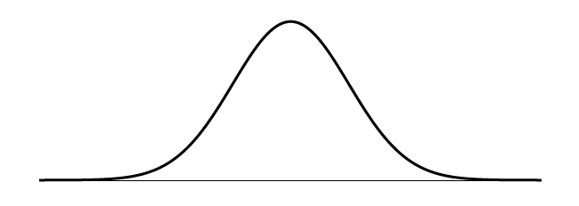
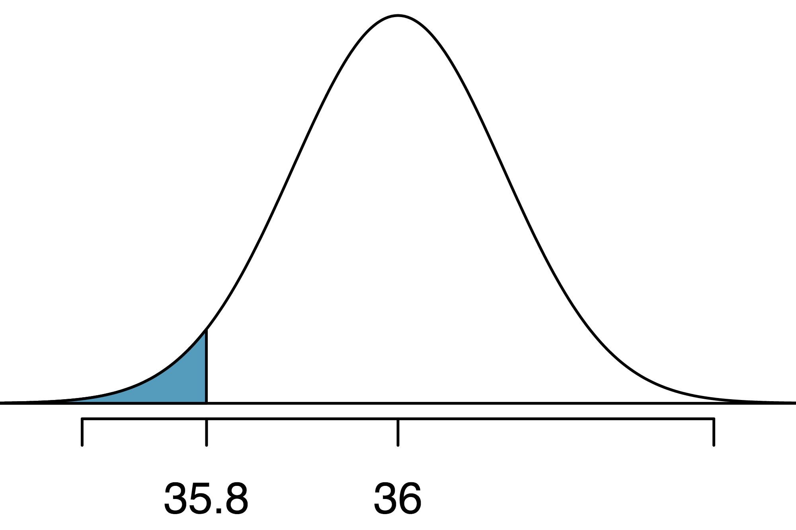
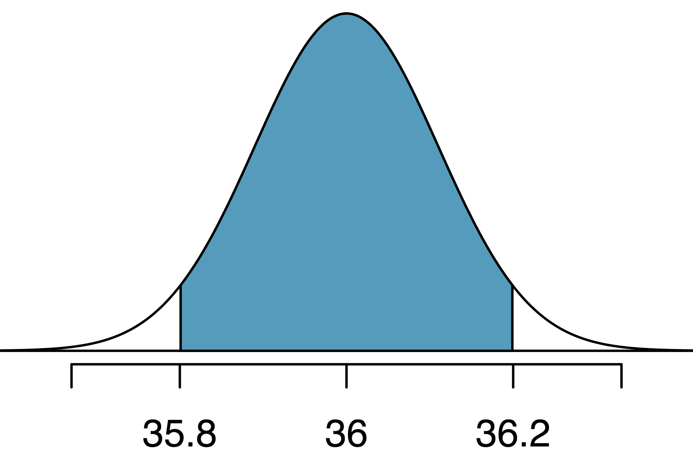
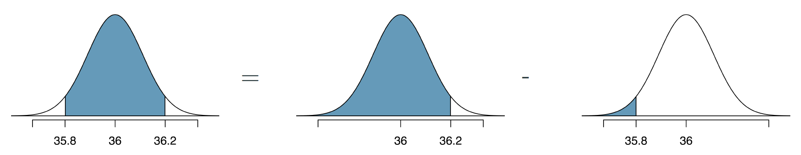
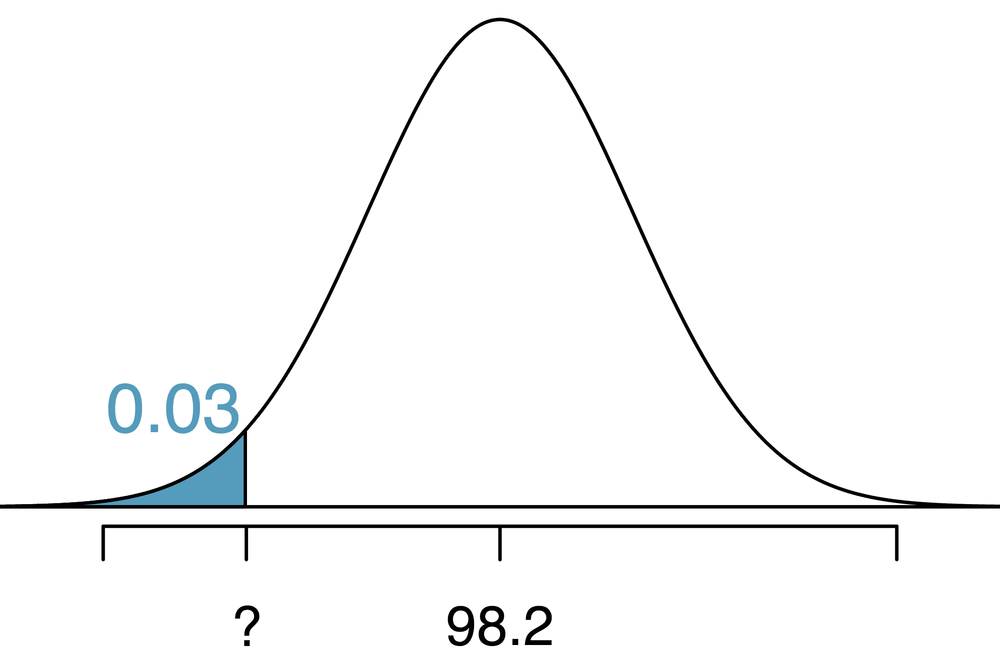
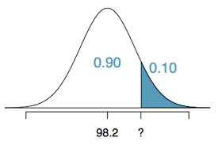
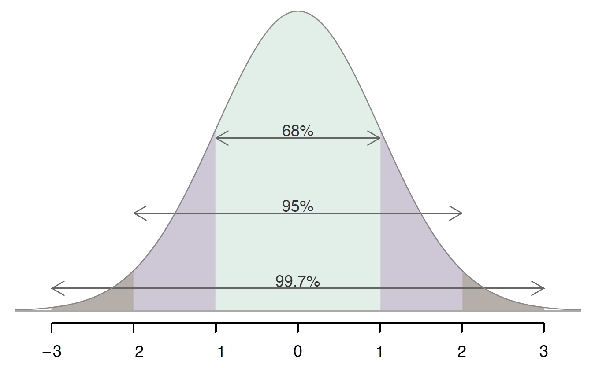

```{r xaringan-themer, include = FALSE}
library(xaringanthemer)
mono_accent(base_color = "#bf67bc") #3E8A83?
```

```{r, include = FALSE}
library(tidyverse)
library(mosaic)
library(oibiostat)
knitr::opts_chunk$set(warning = FALSE, message = FALSE, 
                      echo = TRUE, dpi = 300)

theme_set(theme_minimal() +
  theme(axis.title.x = element_text(size = 14, face = "bold"), 
        axis.title.y = element_text(size = 14, face = "bold"),
        axis.text.x = element_text(size = 12, face = "bold"), 
        axis.text.y = element_text(size = 12, face = "bold")))
#spotify_songs <- read_csv('https://raw.githubusercontent.com/rfordatascience/tidytuesday/master/data/2020/2020-01-21/spotify_songs.csv')
```

<!--
pagedown::chrome_print("~/Dropbox/Teaching/03-Simmons Courses/MATH228-Introduction to Data Science/Lecture Slides/01-Introduction/01-Introduction.html")
-->

class: center, middle, frame

# Module Plan

## The .display[Normal] model
    
--

## .display[Z]-scores
    
--

## Normal .display[probabilities]

--

## .display[68-95-99.7] Rule
    
---

class: center, middle, frame

# The Normal Model

---

# What is it?

.center[
```{r, echo = FALSE, dpi = 100}

```
]

--

- **unimodal**, **symmetric**

- **bell-shaped**

- Area under the Normal curve **adds up to 1**

- Arises in **many applications**

--

.center[
Completely determined by its **mean** (&mu;) and **standard deviation** (&sigma;)
]

---

# Different Normal Distributions

.pull-left[
```{r, echo = FALSE}
set.seed(12)
samp1 <- rnorm(1000, 100, 15)
hist(samp1, xlab = "", main = "")
```

- N(mean = 100, sd = 15)
]

--

.pull-right[
```{r, echo = FALSE}
set.seed(12)
samp2 <- rnorm(1000, 0, 1)
hist(samp2, xlab = "", main = "")
```

- N(mean = 0, sd = 1)
- **Standard Normal distribution**
]

---

# Different Normal Distributions

.center[
```{r, echo = FALSE, out.width = "65%"}
samp <- data.frame(samp1, samp2)
ggplot(samp) + 
  geom_histogram(aes(x = samp2), fill = "gray", binwidth = 0.5) +
  geom_histogram(aes(x = samp1), color = "white", fill = "gray", binwidth = 5) +
  labs(x = "", y = "Count")
```

]

---

# Cheese Truck Example

In September 2019, a big rig carrying *20,000 pounds of cheese* overturned on I-5 in California ([source](https://sacramento.cbslocal.com/2019/09/25/hood-franklin-road-big-rig-crash-elk-grove/)). 
- Traveling 81 miles per hour

--

*Suppose*: The **distribution** of all vehicle speeds traveling on I-5 is *Normal*...
- **Mean**: 72 miles per hour
- **Standard deviation**: 9 miles per hour

--

.center[
```{r, echo = FALSE, out.width = "35%"}
scores <- seq(40, 105, 0.5)
plot(scores, dnorm(scores, 72, 9), col = "darkgreen", xlab = "Vehicle Speed (in mph)", ylab = "", yaxt = "n", type = "l", lwd = 2, cex = 2, cex.axis = .8, bty = "n")
abline(v = 81, col = "red")
text(83.5, 0.0320, "81")
```
]

---

# Random Suburban Street Example

Vehicle speeds while traveling down the quiet, suburban *Random St* are known to *also* follow a *Normal* distribution, with...
- **Mean**: 27 miles per hour
- **Standard deviation**: 2 miles per hour

--

On a beautiful Monday morning, a resident observed a vehicle traveling down *Random St* at a speed of 31 miles per hour!

--

.center[
```{r, echo = FALSE, out.width = "35%"}
scores <- seq(20, 35, 0.25)
plot(scores, dnorm(scores, 27, 2), col = "darkblue", xlab = "Vehicle Speed (in mph)", ylab = "", yaxt = "n", type = "l", lwd = 2, cex = 2, cex.axis = .8, bty = "n")
abline(v = 31, col = "red")
text(31.75, 0.0820, "31")
```
]

- Which vehicle traveled faster, *relative to its respective distribution*?

---

class: center, middle, frame

# Standardizing with Z-scores

---

# Comparing Normal Distributions

.pull-left[
```{r, echo = FALSE}
scores <- seq(40, 105, 0.5)
plot(scores, dnorm(scores, 72, 9), col = "darkgreen", xlab = "Vehicle Speed (in mph)", ylab = "", yaxt = "n", type = "l", lwd = 2, cex = 2, cex.axis = .8, bty = "n")
abline(v = 81, col = "red")
text(83.5, 0.0320, "81")
```
]

.pull-right[
```{r, echo = FALSE}
scores <- seq(20, 35, 0.25)
plot(scores, dnorm(scores, 27, 2), col = "darkblue", xlab = "Vehicle Speed (in mph)", ylab = "", yaxt = "n", type = "l", lwd = 2, cex = 2, cex.axis = .8, bty = "n")
abline(v = 31, col = "red")
text(31.75, 0.0820, "31")
```
]

--

.center[
```{r, echo = FALSE}
summary.data = data.frame(mean = c(72, 27), sd = c(9, 2))
row.names(summary.data) = c("I-5", "Random St")
knitr::kable(summary.data, format = "html", row.names = TRUE)
```
]

---

# Standard Deviation as a Ruler

Using the **standard deviation** as a *guide*...

- The cheese truck was traveling *1 standard deviation* faster than average.

- The Random St vehicle was traveling *2 standard deviations* faster than average.

--

We just calculated and compared two **Z-scores**!

- *Technically* speaking... $$z=\frac{x-\mu}{\sigma}$$
    - *x*: individual *observation*
    - $\mu$: the population **mean**
    - $\sigma$: the population **standard deviation**
    
--

- *Conceptually* speaking...
    - The Z-score is the *number of standard deviations* an observation falls *above or below* the mean. 
    
---

# Visualizing Z-scores

.center[
```{r, echo = FALSE, out.width = "65%"}
scores <- seq(-3, 3, 0.05)
plot(scores, dnorm(scores, 0, 1), col = "black", xlab = "Z", ylab = "", yaxt = "n", type = "l", lwd = 2, cex = 2, cex.axis = .8, bty = "n", main = "Standard Normal, N(0, 1)")
abline(v = 1, col = "darkgreen")
abline(v = 2, col = "darkblue")
text(1.2, 0.3920, "C")
text(2.2, 0.3920, "R")
```
]

---

class: center, middle, frame

# Finding Normal Probabilities (Tail Areas)

---

# Tail Areas

**Tail areas** of distributions play a vital role in statistics. 

- What fraction of test takers scored above 1500 on the SAT?

--

- What proportion of vehicles traveled faster on I-5 than the cheese truck?

--

- What percent of Heinz ketchup bottles pass inspection?!

--

At the *Heinz ketchup factory*, amounts which go into bottles of ketchup are *nearly Normally distributed*. 
- **Mean**: 36 ounces
- **Standard deviation**: 0.11 ounces

--

**Question**: Approximately what proportion of bottles contain *less than* 35.8 ounces?

---

# Normal Tail Areas

**Given**: Ketchup bottle amounts follow a N(36, 0.11) distribution. 

- **Find**: Proportion of bottle amounts **below** 35.8 ounces. 

.center[
```{r, echo = FALSE, out.width = "35%"}

```
]

--

**In R**: We'll use `pnorm()` to find tail areas for the **Normal** distribution. 
- In `pnorm()`, you *must* specify:
    - (i) The observation/cutoff of interest (35.8 in this example)
    - (ii) the `mean` and `sd`. 

--

```{r}
pnorm(35.8, mean = 36, sd = 0.11)
```

---

# pnorm()

.center[
```{r, echo = FALSE, out.width = "35%"}

```
]

```{r}
pnorm(35.8, mean = 36, sd = 0.11)
```

- By default, `pnorm()` calculates the tail area **to the left** of the cutoff point!

**Conclusion**: Approximately 3.45% of Heinz ketchup bottles contain *less than* 35.8 ounces. 

--

**Think about this**

- If the area under the Normal curve **adds to 1**, how could you find the tail area **to the right** of 35.8?

---

# Ketchup, continued

Why did we calculate the tail area to the left of **35.8 ounces**?

- Turns out, the ketchup bottle fails quality control inspection if the amount is *below* 35.8 ounces or *above* 36.2 ounces. 

.center[
**What percent of bottles pass inspection?**
]

--

.center[
```{r, echo = FALSE, out.width = "35%"}

```
]

---

# Ketchup, continued

Why did we calculate the tail area to the left of **35.8 ounces**?

- Turns out, the ketchup bottle fails quality control inspection if the amount is *below* 35.8 ounces or *above* 36.2 ounces. 

.center[
**What percent of bottles pass inspection?**
]

.center[
```{r, echo = FALSE, dpi = 250}

```
]

--

**In R**: 

```{r}
pnorm(36.2, mean = 36, sd = 0.11) - pnorm(35.8, mean = 36, sd = 0.11)
```

--

**Conclusion**: Approximately 93.1% of Heinz ketchup bottles pass inspection. 

---

# Working "Backwards"

.center[
```{r, echo = FALSE, out.width = "35%"}

```
]

**Human body temperatures**, in degrees F: N(mean = 98.2, sd = 0.7)

- What is the *cutoff* for the **lowest 3%** of human body temperatures?

---

# qnorm()

If we're *given* a **tail area** (0.03) and need to find a *cutoff* (or a **percentile**) in a Normal distribution, use `qnorm()`:

```{r}
qnorm(0.03, mean = 98.2, sd = 0.7)
```

--

`qnorm()` works similarly to `pnorm()`: You *must* specify the **mean** and **sd**

- **But**, enter the **left tail area** first, **not** the observation. 

--

<br>

**Conclusion**: About 3% of humans have body temperatures *lower than* **96.9 degrees F**. 

---

# qnorm()

**Question**: How could we find the cutoff for the **top** 10% of human body temperatures?

.center[
```{r, echo = FALSE, out.width = "35%"}

```
]

--

```{r}
qnorm(0.90, mean = 98.2, sd = 0.7)
```

---

class: center, middle, frame 

# The 68-95-99.7 Rule

---

# A quick "rule of thumb"

The **68-95-99.7 Rule** provides a quick way to calculate **Normal distribution** probabilities for observations with specific Z-scores. 

- In order words, the *probability* of falling **within** 1, 2, or 3 standard deviations of the mean

.center[
```{r, echo = FALSE}

```
]

--

Would this work for the Heinz ketchup example? (using observation of **35.8** oz)

---

# The 68-95-99.7 Rule

.center[
```{r, echo = FALSE}

```
]

Using $\mu=36$ (mean) and $\sigma=0.11$ (sd) from the Heinz ketchup example, $$Z_{35.8}=\frac{35.8-36}{0.11}=-1.82$$

--

**In R**:

```{r}
(35.8 - 36)/0.11
```

---

# The 68-95-99.7 Rule

.center[
```{r, echo = FALSE}

```
]

Using $\mu=36$ (mean) and $\sigma=0.11$ (sd) from the Heinz ketchup example...

- (*Approximately*) **68%** of the bottle amounts are between...  
    - $36-0.11=$ **35.89** and $36+0.11=$ **36.11** ounces

- (*Approximately*) 95% of the bottle amounts are between... 
    - $36-(2*0.11)=$ **35.78** and $36+(2*0.11)=$ **36.22** ounces

---

# Verifying the 68-95-99.7 Rule (in R)

.center[
```{r, echo = FALSE}

```
]

How can we use R to calculate the area **between** -1 and 1?

- Note that this is a **standard Normal** N(0, 1) distribution!

--

```{r}
pnorm(1, mean = 0, sd = 1) - pnorm(-1, mean = 0, sd = 1)
```

