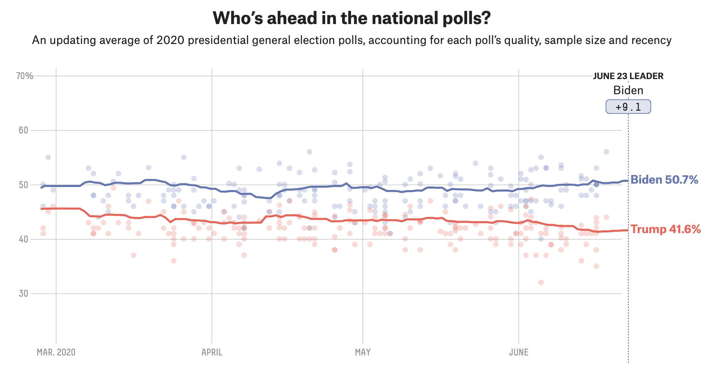

```{r xaringan-themer, include = FALSE}
library(xaringanthemer)
mono_accent(base_color = "#bf67bc") #3E8A83?
```

```{r, include = FALSE}
library(tidyverse)
library(mosaic)
library(moderndive)
library(oibiostat)
library(openintro)
data(COL)
knitr::opts_chunk$set(warning = FALSE, message = FALSE, 
                      echo = TRUE, dpi = 300)

theme_set(theme_minimal() +
  theme(axis.title.x = element_text(size = 14, face = "bold"), 
        axis.title.y = element_text(size = 14, face = "bold"),
        axis.text.x = element_text(size = 12, face = "bold"), 
        axis.text.y = element_text(size = 12, face = "bold")))
#spotify_songs <- read_csv('https://raw.githubusercontent.com/rfordatascience/tidytuesday/master/data/2020/2020-01-21/spotify_songs.csv')
```

<!--
pagedown::chrome_print("~/Dropbox/Teaching/03-Simmons Courses/MATH228-Introduction to Data Science/Lecture Slides/01-Introduction/01-Introduction.html")
-->

class: center, middle, frame

# Module Plan

## .display[Variability] in estimates
    
--

## .display[Central Limit Theorem] (CLT)
    
--

## .display[Constructing] confidence intervals

--

## .display[Interpreting] confidence intervals
    
---

class: center, middle, frame

# Variability in Estimates

---

# Point Estimates

[Fox News general election poll (June 18, 2020)](https://static.foxnews.com/foxnews.com/content/uploads/2020/06/Fox_June-13-16-2020_National_Topline_June-18-Release.pdf): $n=1343$ *registered voters*

- Biden: 50%

- Trump: 38%

--

- **margin of sampling error** of $\pm 2.5$ percentage points

--

The 50% is a **point estimate** of the percentage of *all* registered voters who will vote for Vice President Joe Biden in the 2020 presidential election. 
- When the point estimate is a **proportion**, we define it with $\hat{p}$ ("*p-hat*").

--

We **do not know** $p$, the proportion of *all* registered voters who will vote for Biden. 
- $\hat{p}=0.50$ represents our "best guess" at $p$ (**parameter**). 

---

# Sampling Error

But **samples vary**! That's why not all presidential polls are *identical*. 

.center[
```{r, echo = FALSE}

```
]

- [Source: fivethirtyeight.com](https://projects.fivethirtyeight.com/polls/president-general/national/)

--

**Sampling variability** (or *uncertainty*) describes how a *point estimate* might vary from one sample to the next. 

---

# Understanding Variability

Let's take a step back. **Assume** that 48% of registered voters will vote for Joe Biden in the election. 

- (Using the 48% that Hillary Clinton received in the 2016 election)

- **Assume**: $p=0.48$

--

**Question**: If we were to *poll* 1,343 registered voters from this population, would 48% say they're voting for Biden?

--

- What if we polled a *second sample* of 1,343 registered voters? A third sample?

--

.center[
**How much will the $\hat{p}$ values vary around 0.48?**
]

---

# Simulations!

$n = 1343$

**Sample 1**

```{r, echo = FALSE}
set.seed(1)
outcomes = c("Biden", "Other")
sample_1 = resample(outcomes, size = 1343, prob = c(0.48, 0.52))
phat_1 = tally(~ sample_1, format = "proportion")[1]
phat_1
```

--

**Sample 2**

```{r, echo = FALSE}
set.seed(2)
outcomes = c("Biden", "Other")
sample_2 = resample(outcomes, size = 1343, prob = c(0.48, 0.52))
phat_2 = tally(~ sample_2, format = "proportion")[1]
phat_2
```

--

**Sample 3**

```{r, echo = FALSE}
set.seed(3)
outcomes = c("Biden", "Other")
sample_3 = resample(outcomes, size = 1343, prob = c(0.48, 0.52))
phat_3 = tally(~ sample_3, format = "proportion")[1]
phat_3
```

--

**Sample 4**

```{r, echo = FALSE}
set.seed(4)
outcomes = c("Biden", "Other")
sample_4 = resample(outcomes, size = 1343, prob = c(0.48, 0.52))
phat_4 = tally(~ sample_4, format = "proportion")[1]
phat_4
```

---

# Simulations!

$n = 1343$

**Sample 5**

```{r, echo = FALSE}
set.seed(5)
outcomes = c("Biden", "Other")
sample_5 = resample(outcomes, size = 1343, prob = c(0.48, 0.52))
phat_5 = tally(~ sample_5, format = "proportion")[1]
phat_5
```

**Sample 6**

```{r, echo = FALSE}
set.seed(6)
outcomes = c("Biden", "Other")
sample_6 = resample(outcomes, size = 1343, prob = c(0.48, 0.52))
phat_6 = tally(~ sample_6, format = "proportion")[1]
phat_6
```

**Sample 7**

```{r, echo = FALSE}
set.seed(7)
outcomes = c("Biden", "Other")
sample_7 = resample(outcomes, size = 1343, prob = c(0.48, 0.52))
phat_7 = tally(~ sample_7, format = "proportion")[1]
phat_7
```

**Sample 8**

```{r, echo = FALSE}
set.seed(8)
outcomes = c("Biden", "Other")
sample_8 = resample(outcomes, size = 1343, prob = c(0.48, 0.52))
phat_8 = tally(~ sample_8, format = "proportion")[1]
phat_8
```

---

# Many (Simulated) Samples

What if we took *many* samples of size $n=1343$ from the population of registered voters?
- Assuming that $p=0.48$ will vote Biden

--

.center[
```{r, echo = FALSE, out.width = "50%"}
set.seed(12)
sampling_dist = do(1000)*tally( ~ resample(outcomes, size = 1343, prob = c(0.48, 0.52)), 
                                format = "proportion")[1]
gf_histogram( ~ Biden, data = sampling_dist)
```
]

---

# Sampling Distributions

We just simulated a **sampling distribution**!

.center[
```{r, echo = FALSE, out.width = "35%"}
set.seed(12)
sampling_dist = do(1000)*tally( ~ resample(outcomes, size = 1343, prob = c(0.48, 0.52)), 
                                format = "proportion")[1]
gf_histogram( ~ Biden, data = sampling_dist)
```
]

A few key points:

- These are never actually observed in real-life. (Why? **Only one sample**!)

--

- Still, think of a **point estimate** ("a poll finds that 50% will vote for Biden) as coming from such a hypothetical distribution. 

--

- We also just simulated the **Central Limit Theorem**!

---

class: center, middle, frame

# Central Limit Theorem

---

# Central Limit Theorem (CLT)

When:
- observations are **independent**, and
- the sample size is **sufficiently large**, 

the sample proportion, $\hat{p}$, will follow a **Normal distribution** with *mean* and *standard deviation* given by: $$\mu_{\hat{p}}=p\quad\text{and}\quad SD_\hat{p}=\sqrt{\frac{p(1-p)}{n}}$$

--

**Independence**: Usually satisfied if observations are selected **randomly**

--

*Sufficiently large* sample size: There are *at least* 10 of each possible outcome (i.e., Biden vs Trump voters). 

--

- This is called the **success-failure condition**. 
    - Check $np\geq 10$ and $n(1-p)\geq10$
    - In our simulations, $n=1343$ and $p=0.48$. 
    
---

# Calculating Standard Deviation 

Using $n=1343$ and $p=0.48$ from our simulations, $$SD_{\hat{p}}=\sqrt{\frac{p(1-p)}{n}}=\sqrt{\frac{0.48*0.52}{1343}}=0.014$$

--

```{r}
sqrt(0.48*0.52/1343)
```

--

.center[
```{r, echo = FALSE, out.width = "40%"}
set.seed(12)
sampling_dist = do(1000)*tally( ~ resample(outcomes, size = 1343, prob = c(0.48, 0.52)), 
                                format = "proportion")[1]
gf_histogram( ~ Biden, data = sampling_dist)
```
]

---

# Applying the CLT in real-life

A researcher can't just collect hundreds of different samples in real-life!

- How can we verify that the sample proportion will follow a Normal distribution?

--

**Check conditions!**

Using the [Fox News poll](https://static.foxnews.com/foxnews.com/content/uploads/2020/06/Fox_June-13-16-2020_National_Topline_June-18-Release.pdf) with $n=1343$ and $\hat{p}=0.50$:

- **Independence**: poll stated it collected a **random sample** of registered voters

--

- **Success-Failure condition**: Check $np\geq 10$ and $n(1-p)\geq10$... but we don't know $p$...
    - Use $\hat{p}$ as an approximation (because it represents our "best guess")! 

--

```{r}
1343*0.50
```

---

# Standard Error

By the **Central Limit Theorem**, $\hat{p}$ follows a **Normal distribution**: $$N\left(p, \sqrt{\frac{p(1-p)}{n}}\right)$$

- But we still don't know $p$!

--

To *approximate* the standard deviation, plug in $\hat{p}$ in place of $p$: $$SE_{\hat{p}}=\sqrt{\frac{0.50(1-0.50)}{1343}}=0.014$$

--

```{r}
sqrt(0.50*0.50/1343)
```

This standard deviation is *so special* that it has its own name: the **standard error** of $\hat{p}$!

---

class: center, middle, frame

# Constructing Confidence Intervals

---

# Back to the Point Estimate

[Fox News general election poll (June 18, 2020)](https://static.foxnews.com/foxnews.com/content/uploads/2020/06/Fox_June-13-16-2020_National_Topline_June-18-Release.pdf): $n=1343$ *registered voters*

- Biden: 50%

**Question**: What does the 50% represent?

--

.center[
A *single plausible value* for the percent of **all** Biden voters on election day.
]

.center[
```{r, echo = FALSE, fig.width = 5, fig.asp = .32, out.width = "60%"}
data.frame(range = seq(0, 1, 0.01)) %>%
  ggplot(aes(x = range)) + 
  geom_blank() + 
  annotate("point", x = 0.50, y = 0.25, size = 3) + 
  scale_x_continuous(labels = scales::percent_format(accuracy = 1), limits = c(0.4, 0.6)) +
  theme_minimal() + 
  labs(x = "", y = "", title = "Point Estimate") + 
  theme(axis.title.y = element_blank(),
        axis.text.y = element_blank(),
        axis.ticks.y = element_blank(), 
        axis.text.x = element_text(size = 12, face = "bold"))
```
]

--

We *just found* that this value *isn't perfect*. 

- The **standard error** is 0.014 (or 1.4%). 

---

# What's better than a point estimate?

.center[
```{r, echo = FALSE, fig.width = 5, fig.asp = .32, out.width = "60%"}
data.frame(range = seq(0, 1, 0.01)) %>%
  ggplot(aes(x = range)) + 
  geom_blank() + 
  annotate("point", x = 0.50, y = 0.25, size = 3) + 
  scale_x_continuous(labels = scales::percent_format(accuracy = 1), limits = c(0.4, 0.6)) +
  theme_minimal() + 
  labs(x = "", y = "", title = "Point Estimate") + 
  theme(axis.title.y = element_blank(),
        axis.text.y = element_blank(),
        axis.ticks.y = element_blank(), 
        axis.text.x = element_text(size = 12, face = "bold"))
```
]

--

.pull-left[
```{r, echo = FALSE, dpi = 200}
knitr::include_graphics("upgrade.jpeg")
```
]

.center[
```{r, echo = FALSE, fig.width = 5, fig.asp = .32, out.width = "60%"}
data.frame(range = seq(0, 1, 0.01)) %>%
  ggplot(aes(x = range)) + 
  geom_blank() + 
  annotate("point", x = 0.50, y = 0.25, size = 3) + 
  geom_segment(y = 0.25, yend = 0.25, 
               x = 0.47256, xend = 0.52744, 
               color = "red", lty = 2) + 
  scale_x_continuous(labels = scales::percent_format(accuracy = 1), limits = c(0.4, 0.6)) +
  theme_minimal() + 
  labs(x = "", y = "", title = "Point Estimate (plus 95% Confidence Interval)") + 
  theme(axis.title.y = element_blank(),
        axis.text.y = element_blank(),
        axis.ticks.y = element_blank(), 
        axis.text.x = element_text(size = 12, face = "bold"))
```
]

---

# Confidence Intervals

A **confidence interval (CI)** represents a *range of plausible values* for an unknown population parameter. 

--

.pull-left[
A *single point estimate* is similar to fishing in a murky lake with a spear. 

```{r, echo = FALSE, dpi = 100}

```
]

--

.pull-right[
A **confidence interval** is like fishing with a net!

```{r, echo = FALSE, dpi = 100}
knitr::include_graphics("net.jpg")
```
]

--

<br>

.center[
```{r, echo = FALSE, fig.width = 5, fig.asp = .32, out.width = "60%"}
data.frame(range = seq(0, 1, 0.01)) %>%
  ggplot(aes(x = range)) + 
  geom_blank() + 
  annotate("point", x = 0.50, y = 0.25, size = 3) + 
  geom_segment(y = 0.25, yend = 0.25, 
               x = 0.47256, xend = 0.52744, 
               color = "red", lty = 2) + 
  geom_vline(xintercept = 0.48, color = "blue") +
  scale_x_continuous(labels = scales::percent_format(accuracy = 1), limits = c(0.4, 0.6)) +
  theme_minimal() + 
  labs(x = "", y = "", title = "Point Estimate (plus 95% Confidence Interval)", 
       subtitle = "(blue line represents population parameter, p)") + 
  theme(axis.title.y = element_blank(),
        axis.text.y = element_blank(),
        axis.ticks.y = element_blank(), 
        axis.text.x = element_text(size = 12, face = "bold"))
```
]

---

# Constructing CIs

The **point estimate**, $\hat{p}$, represents a *plausible* value for the population **parameter**, $p$.

- So we can build the CI around $\hat{p}$! $$\hat{p}$$

--

The **standard error**, $SE_{\hat{p}}$, represents the estimated amount of *variability* one might expect in $\hat{p}$ from sample to sample. 

- The $SE_{\hat{p}}$ provides a guide for how *wide* the CI is on either side of $\hat{p}$. $$\hat{p}\pm\  ?*SE_{\hat{p}}$$

--

But what is "?"

- This depends on our chosen **confidence level**. 

---

# Constructing 95% CIs

**Recall**: When the **Central Limit Theorem** conditions are satisfied, $\hat{p}$ follows a *Normal* distribution. 

.pull-left[

```{r, echo = FALSE, fig.height = 4}
par(mar = c(3.3, 1, 0.15, 1), mgp = c(2.1, 0.6, 0))
normTail(M = c(-1.96, 1.96),
         df = 10,
         col = COL[1],
         xlim = 3.3 * c(-1, 1),
         ylim = c(0, 0.59),
         xlab='Standard Deviations from the Mean')
X <- rev(seq(-4, 4, 0.025))
Y <- dt(X, 10) # makes better visual
yMax <- 0.41
lines(1.96*c(-1,1), rep(yMax,2), lwd=2)
lines(rep(-1.96,2), c(0,yMax), lty=2, col=COL[6])
lines(rep( 1.96,2), c(0,yMax), lty=2, col=COL[6])
text(0, yMax, '95%', pos=3)
```
]

--

.pull-right[
```{r, echo = FALSE, fig.height = 4}
par(mar = c(3.3, 1, 0.15, 1), mgp = c(2.1, 0.6, 0))
normTail(M = c(-1.96, 1.96),
         df = 10,
         col = COL[1],
         xlim = 3.3 * c(-1, 1),
         ylim = c(0, 0.59),
         xlab='Standard Deviations from the Mean')
X <- rev(seq(-4, 4, 0.025))
Y <- dt(X, 10) # makes better visual
yMax <- 0.41
lines(1.96*c(-1,1), rep(yMax,2), lwd=2)
lines(rep(-1.96,2), c(0,yMax), lty=2, col=COL[6])
lines(rep( 1.96,2), c(0,yMax), lty=2, col=COL[6])
text(0, yMax, '95%, extends -1.96 to 1.96', pos=3)
```
]

--

We can be **95% confident** that this interval catches the population parameter: $$\text{point estimate} \pm1.96*SE$$

--

95% confidence intervals for $p$: $$\hat{p}\pm 1.96*\sqrt{\frac{\hat{p}(1-\hat{p})}{n}}$$

---

# Constructing 95% CIs

For the Fox News poll:

- $\hat{p}=0.50$ (50% of the sample plan to vote for Biden)
- $SE_{\hat{p}}=0.014$

--

Putting it together: $$\hat{p}\pm 1.96*\sqrt{\frac{\hat{p}(1-\hat{p})}{n}}=0.50\pm1.96*0.014=(0.473, 0.527)$$

--

We are **95% confident** that between 47.3% and 52.7% of all registered voters will vote for Joe Biden in the 2020 presidential election. 

.center[
```{r, echo = FALSE, fig.width = 5, fig.asp = .32, out.width = "60%"}
data.frame(range = seq(0, 1, 0.01)) %>%
  ggplot(aes(x = range)) + 
  geom_blank() + 
  annotate("point", x = 0.50, y = 0.25, size = 3) + 
  geom_segment(y = 0.25, yend = 0.25, 
               x = 0.47256, xend = 0.52744, 
               color = "red", lty = 2) + 
  scale_x_continuous(labels = scales::percent_format(accuracy = 1), limits = c(0.4, 0.6)) +
  theme_minimal() + 
  labs(x = "", y = "", title = "95% Confidence Interval (n = 1343)") + 
  theme(axis.title.y = element_blank(),
        axis.text.y = element_blank(),
        axis.ticks.y = element_blank(), 
        axis.text.x = element_text(size = 12, face = "bold"))
```
]

---

# 95% Confident?

What does "95% confident" mean?

- Suppose we took *many* $n=1343$ polls of registered voters, and constructed a 95% confidence interval from each.
    - **Approximately** 95% of the CIs would cover the *population parameter*.

--

.center[
```{r, echo = FALSE, fig.width = 5, fig.asp = .92, out.width = "50%"}
moe = 1.96*sqrt(0.48*0.52/1343)

data.frame(range = seq(0, 1, 0.04), y = seq(0, 25, 1)) %>%
  ggplot(aes(x = range, y = y)) + 
  geom_blank() + 
  annotate("point", x = 0.50, y = 0, size = 1.5) + 
  geom_segment(aes(y = 0, yend = 0, 0.47256, xend = 0.52744)) + 
  annotate("point", x = 0.47, y = 1, size = 1.5) + 
  geom_segment(aes(y = 1, yend = 1, 0.47-moe, xend = 0.47+moe)) + 
  annotate("point", x = 0.48256, y = 2, size = 1.5) + 
  geom_segment(aes(y = 2, yend = 2, 0.48256-moe, xend = 0.48256+moe)) + 
  annotate("point", x = 0.46256, y = 3, size = 1.5) + 
  geom_segment(aes(y = 3, yend = 3, 0.46256-moe, xend = 0.46256+moe)) + 
  annotate("point", x = 0.47856, y = 4, size = 1.5) + 
  geom_segment(aes(y = 4, yend = 4, 0.47856-moe, xend = 0.47856+moe)) + 
  annotate("point", x = 0.45856, y = 5, size = 1.5) + 
  geom_segment(aes(y = 5, yend = 5, 0.45856-moe, xend = 0.45856+moe)) + 
  annotate("point", x = 0.47556, y = 6, size = 1.5) + 
  geom_segment(aes(y = 6, yend = 6, 0.47556-moe, xend = 0.47556+moe)) + 
  annotate("point", x = 0.49856, y = 7, size = 1.5) + 
  geom_segment(aes(y = 7, yend = 7, 0.49856-moe, xend = 0.49856+moe)) + 
  annotate("point", x = 0.46256, y = 8, size = 1.5) + 
  geom_segment(aes(y = 8, yend = 8, 0.46256-moe, xend = 0.46256+moe)) + 
  annotate("point", x = 0.47356, y = 9, size = 1.5) + 
  geom_segment(aes(y = 9, yend = 9, 0.47356-moe, xend = 0.47356+moe)) + 
  annotate("point", x = 0.48856, y = 10, size = 1.5) + 
  geom_segment(aes(y = 10, yend = 10, 0.48856-moe, xend = 0.48856+moe)) + 
  annotate("point", x = 0.50856, y = 11, size = 1.5) + 
  geom_segment(aes(y = 11, yend = 11, 0.50856-moe, xend = 0.50856+moe)) + 
  annotate("point", x = 0.49856, y = 12, size = 1.5) + 
  geom_segment(aes(y = 12, yend = 12, 0.49856-moe, xend = 0.49856+moe)) + 
  annotate("point", x = 0.48456, y = 13, size = 1.5) + 
  geom_segment(aes(y = 13, yend = 13, 0.48456-moe, xend = 0.48456+moe)) + 
  annotate("point", x = 0.49156, y = 14, size = 1.5) + 
  geom_segment(aes(y = 14, yend = 14, 0.49156-moe, xend = 0.49156+moe)) + 
  annotate("point", x = 0.51256, y = 15, size = 1.5) + 
  geom_segment(aes(y = 15, yend = 15, 0.49315-moe, xend = 0.49315+moe)) + 
  annotate("point", x = 0.47576, y = 16, size = 1.5) + 
  geom_segment(aes(y = 16, yend = 16, 0.47576-moe, xend = 0.47576+moe)) + 
  annotate("point", x = 0.50356, y = 17, size = 1.5) + 
  geom_segment(aes(y = 17, yend = 17, 0.50356-moe, xend = 0.50356+moe)) + 
  annotate("point", x = 0.44856, y = 18, size = 1.5, color = "red", size = 1.5) + 
  geom_segment(aes(y = 18, yend = 18, 0.44856-moe, xend = 0.44856+moe), color = "red", lwd = 1) + 
  annotate("point", x = 0.49156, y = 19, size = 1.5) + 
  geom_segment(aes(y = 19, yend = 19, 0.49156-moe, xend = 0.49156+moe)) + 
  annotate("point", x = 0.50456, y = 20, size = 1.5) + 
  geom_segment(aes(y = 20, yend = 20, 0.50456-moe, xend = 0.50456+moe)) + 
  annotate("point", x = 0.48914, y = 21, size = 1.5) + 
  geom_segment(aes(y = 21, yend = 21, 0.48914-moe, xend = 0.48914+moe)) + 
  annotate("point", x = 0.46145, y = 22, size = 1.5) + 
  geom_segment(aes(y = 22, yend = 22, 0.46145-moe, xend = 0.46145+moe)) + 
  annotate("point", x = 0.49256, y = 23, size = 1.5) + 
  geom_segment(aes(y = 23, yend = 23, 0.49256-moe, xend = 0.49256+moe)) + 
  annotate("point", x = 0.50856, y = 24, size = 1.5) + 
  geom_segment(aes(y = 24, yend = 24, 0.50856-moe, xend = 0.50856+moe)) + 
  geom_vline(xintercept = 0.48, color = "blue") +
  scale_x_continuous(labels = scales::percent_format(accuracy = 1), limits = c(0.4, 0.6)) +
  theme_minimal() + 
  labs(x = "", y = "", title = "95% Confidence Intervals (n = 1343)", 
       subtitle = "(blue line represents population parameter, p)") + 
  theme(axis.title.y = element_blank(),
        axis.text.y = element_blank(),
        axis.ticks.y = element_blank(), 
        axis.text.x = element_text(size = 12, face = "bold"))
```
]

---

# Changing the Confidence Level

95% is the most frequently-used **confidence level**.
- But what if we wanted to change it to 99%?

--

It turns out that **99% of a Normal distribution** is contained within *2.58 standard deviations* from the mean. 

.center[
```{r, echo = FALSE, fig.height = 3, out.width = "75%"}
par(mar = c(3.3, 1, 0.15, 1), mgp = c(2.1, 0.6, 0))
normTail(M = c(-1.96, 1.96),
         df = 10,
         col = COL[1],
         xlim = 3.3 * c(-1, 1),
         ylim = c(0, 0.59),
         xlab='Standard Deviations from the Mean')
X <- rev(seq(-4, 4, 0.025))
Y <- dt(X, 10) # makes better visual

yMax <- 0.41

these <- (-2.58 < X & X < 2.58)
x <- c(2.58, X[these], -2.58)
y <- c(0, dt(X[these], 10), 0)
polygon(x, y, col=COL[1,3], border='#00000000')

lines(1.96*c(-1,1), rep(yMax,2), lwd=2)
lines(rep(-1.96,2), c(0,yMax), lty=2, col=COL[6])
lines(rep( 1.96,2), c(0,yMax), lty=2, col=COL[6])
text(0, yMax, '95%, extends -1.96 to 1.96', pos=3)

yMax <- 0.53
lines(2.58*c(-1,1), rep(yMax,2), lwd=2)
lines(rep(-2.58,2), c(0,yMax), lty=2, col='#00000055')
lines(rep( 2.58,2), c(0,yMax), lty=2, col='#00000055')
text(0, yMax, '99%, extends -2.58 to 2.58', pos=3)
```
]

--

.pull-left[
**95% confidence interval** $$\text{point estimate} \pm1.96*SE$$
]

.pull-right[
**99% confidence interval** $$\text{point estimate} \pm2.58*SE$$
]

---

# Finding 1.96 and 2.58 (in R)

You can use `qnorm()` to find these *Normal quantiles* in R:

.pull-left[
```{r}
qnorm(0.975) # For 95% CI
qnorm(0.995) # For 99% CI
```
]

.pull-right[
Or more generally:
```{r}
val = 1 - (1-0.95)/2 # For 95% CI
qnorm(val)
```
]

.center[
```{r, echo = FALSE, fig.height = 3, out.width = "75%"}
par(mar = c(3.3, 1, 0.15, 1), mgp = c(2.1, 0.6, 0))
normTail(M = c(-1.96, 1.96),
         df = 10,
         col = COL[1],
         xlim = 3.3 * c(-1, 1),
         ylim = c(0, 0.59),
         xlab='Standard Deviations from the Mean')
X <- rev(seq(-4, 4, 0.025))
Y <- dt(X, 10) # makes better visual

yMax <- 0.41

these <- (-2.58 < X & X < 2.58)
x <- c(2.58, X[these], -2.58)
y <- c(0, dt(X[these], 10), 0)
polygon(x, y, col=COL[1,3], border='#00000000')

lines(1.96*c(-1,1), rep(yMax,2), lwd=2)
lines(rep(-1.96,2), c(0,yMax), lty=2, col=COL[6])
lines(rep( 1.96,2), c(0,yMax), lty=2, col=COL[6])
text(0, yMax, '95%, extends -1.96 to 1.96', pos=3)

yMax <- 0.53
lines(2.58*c(-1,1), rep(yMax,2), lwd=2)
lines(rep(-2.58,2), c(0,yMax), lty=2, col='#00000055')
lines(rep( 2.58,2), c(0,yMax), lty=2, col='#00000055')
text(0, yMax, '99%, extends -2.58 to 2.58', pos=3)
```
]

---

# Smaller sample size?

What if a poll of $n=250$ registered voters instead of $n=1343$ found that 50% planned to vote Biden?

--

.center[
```{r, echo = FALSE, fig.width = 5, fig.asp = .32, out.width = "60%"}
data.frame(range = seq(0, 1, 0.01)) %>%
  ggplot(aes(x = range)) + 
  geom_blank() + 
  annotate("point", x = 0.50, y = 0.25, size = 3) + 
  geom_segment(y = 0.25, yend = 0.25, 
               x = 0.47256, xend = 0.52744, 
               color = "red", lty = 2) + 
  scale_x_continuous(labels = scales::percent_format(accuracy = 1), limits = c(0.4, 0.6)) +
  theme_minimal() + 
  labs(x = "", y = "", title = "95% Confidence Interval (n = 1343)") + 
  theme(axis.title.y = element_blank(),
        axis.text.y = element_blank(),
        axis.ticks.y = element_blank(), 
        axis.text.x = element_text(size = 12, face = "bold"))
```
]

<br>

.center[
```{r, echo = FALSE, fig.width = 5, fig.asp = .32, out.width = "60%"}
data.frame(range = seq(0, 1, 0.01)) %>%
  ggplot(aes(x = range)) + 
  geom_blank() + 
  annotate("point", x = 0.50, y = 0.25, size = 3) + 
  geom_segment(y = 0.25, yend = 0.25, 
               x = 0.4380194, xend = 0.5619806, 
               color = "red", lty = 2) + 
  scale_x_continuous(labels = scales::percent_format(accuracy = 1), limits = c(0.4, 0.6)) +
  theme_minimal() + 
  labs(x = "", y = "", title = "95% Confidence Interval (n = 250)") + 
  theme(axis.title.y = element_blank(),
        axis.text.y = element_blank(),
        axis.ticks.y = element_blank(), 
        axis.text.x = element_text(size = 12, face = "bold"))
```
]

---

class: center, middle, frame

# Interpreting Confidence Intervals

---

# Case Study

In a [2013 Phase I trial](https://www.nejm.org/doi/pdf/10.1056/NEJMoa1302369), researchers found that 21/52 (40.4%) of advanced melanoma patients experienced an *immune response* to use of two concurrent treatments. 
- $n=52$, $\hat{p}=0.404$

--

The **95% confidence interval** is (0.271, 0.537), or (27.1%, 53.7%). 
- What does this mean?

--

We are **95% confident** that the population immune response proportion in patients with advanced melanoma is *between 27.1% and 53.7%*. 

.center[
```{r, echo = FALSE, fig.width = 5, fig.asp = .32, out.width = "60%"}
data.frame(range = seq(0, 1, 0.01)) %>%
  ggplot(aes(x = range)) + 
  geom_blank() + 
  annotate("point", x = 0.404, y = 0.25, size = 3) + 
  geom_segment(y = 0.25, yend = 0.25, 
               x = 0.2706269, xend = 0.5373731, 
               color = "red", lty = 2) + 
  scale_x_continuous(labels = scales::percent_format(accuracy = 1), limits = c(0.2, 0.6)) +
  theme_minimal() + 
  labs(x = "", y = "", title = "95% Confidence Interval") + 
  theme(axis.title.y = element_blank(),
        axis.text.y = element_blank(),
        axis.ticks.y = element_blank(), 
        axis.text.x = element_text(size = 12, face = "bold"))
```
]

---

# Interpreting CIs

We are **95% confident** that the population immune response proportion in patients with advanced melanoma is *between 27.1% and 53.7%*. 

.center[
```{r, echo = FALSE, fig.width = 5, fig.asp = .32, out.width = "60%"}
data.frame(range = seq(0, 1, 0.01)) %>%
  ggplot(aes(x = range)) + 
  geom_blank() + 
  annotate("point", x = 0.404, y = 0.25, size = 3) + 
  geom_segment(y = 0.25, yend = 0.25, 
               x = 0.2706269, xend = 0.5373731, 
               color = "red", lty = 2) + 
  scale_x_continuous(labels = scales::percent_format(accuracy = 1), limits = c(0.2, 0.6)) +
  theme_minimal() + 
  labs(x = "", y = "", title = "95% Confidence Interval") + 
  theme(axis.title.y = element_blank(),
        axis.text.y = element_blank(),
        axis.ticks.y = element_blank(), 
        axis.text.x = element_text(size = 12, face = "bold"))
```
]

What this interpretation *does*:

- Makes a statement about the **population parameter**

- Expresses **uncertainty**

---

# Interpreting CIs

We are **95% confident** that the population immune response proportion in patients with advanced melanoma is *between 27.1% and 53.7%*. 

.center[
```{r, echo = FALSE, fig.width = 5, fig.asp = .32, out.width = "60%"}
data.frame(range = seq(0, 1, 0.01)) %>%
  ggplot(aes(x = range)) + 
  geom_blank() + 
  annotate("point", x = 0.404, y = 0.25, size = 3) + 
  geom_segment(y = 0.25, yend = 0.25, 
               x = 0.2706269, xend = 0.5373731, 
               color = "red", lty = 2) + 
  scale_x_continuous(labels = scales::percent_format(accuracy = 1), limits = c(0.2, 0.6)) +
  theme_minimal() + 
  labs(x = "", y = "", title = "95% Confidence Interval") + 
  theme(axis.title.y = element_blank(),
        axis.text.y = element_blank(),
        axis.ticks.y = element_blank(), 
        axis.text.x = element_text(size = 12, face = "bold"))
```
]

What this interpretation *does not do*:

- Makes a *definitive* statement about the **population parameter**
    - (we are not 100% confident)
    
- Makes a statement about *individual observations* or **point estimates**


