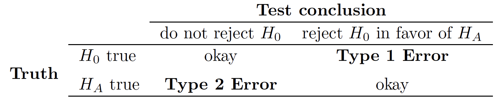

```{r xaringan-themer, include = FALSE}
library(xaringanthemer)
mono_accent(base_color = "#bf67bc") #3E8A83?
```

```{r, include = FALSE}
library(tidyverse)
library(mosaic)
library(moderndive)
library(oibiostat)
library(openintro)
set.seed(12)
data(COL)
knitr::opts_chunk$set(warning = FALSE, message = FALSE, 
                      echo = TRUE, dpi = 300)

theme_set(theme_minimal() +
  theme(axis.title.x = element_text(size = 14, face = "bold"), 
        axis.title.y = element_text(size = 14, face = "bold"),
        axis.text.x = element_text(size = 12, face = "bold"), 
        axis.text.y = element_text(size = 12, face = "bold")))
```

<!--
pagedown::chrome_print("~/Dropbox/Teaching/03-Simmons Courses/MATH228-Introduction to Data Science/Lecture Slides/01-Introduction/01-Introduction.html")
-->

class: center, middle, frame

# Module Plan

## .display[Hypothesis testing] framework
    
--

## Relationship between hypothesis testing and .display[confidence intervals]
    
--

## Decision .display[errors]

--

##Formal testing using .display[p-values]
    
---

class: center, middle, frame

# Hypothesis Testing Framework

---

# Case Study: Sleep and Memory

```{r, echo = FALSE}
Sleep <- read.csv("http://www.mosaic-web.org/go/datasets/SleepCaffeine.csv")
```

[Mednick et al. (2008)](https://www.ncbi.nlm.nih.gov/pmc/articles/PMC2603066/pdf/nihms65981.pdf): 24 adults given lists of 24 words to memorize. Afterwards, the adults were *randomized* to one of two groups:
- **Group 1**: took 90-minute nap
- **Group 2**: stayed awake and given a caffeine pill

--

.pull-left[
**Results**

```{r}
mean(Words ~ Group, data = Sleep)
```

- Sleep group had higher **mean word recall**. 
]

.pull-right[
```{r, echo = FALSE}
gf_boxplot(Words ~ Group, data = Sleep)
```
]

---

# Observed Statistic

The **observed statistic** (or *point estimate*) is $\bar{x}_{\text{sleep}}-\bar{x}_{\text{caff}}=3$. 

- Is this difference *large enough* to conclude that sleep is associated with improved memory, or is it simply **due to chance**?

--

In other words, we're testing **two competing claims**:

- $H_{0}$ (**null hypothesis**): Sleep and memory are *independent* 
    - The difference in means was **due to chance**. 

--

- $H_{A}$ (**alternative hypothesis**): Sleep is **associated** with improved memory. 
    - The difference in means was *not* **due to chance**. 
    
---

# Null Hypothesis

What would it mean if the **null hypothesis**, which claims that sleep and memory are independent, is *true*?

- The **results** were due to the way that the study participants were *shuffled* into groups. 
    
--

**Question**: How do we choose between $H_{0}$ (*null*) and $H_{A}$ (*alternative*)? 🤔🤔🤔

- We'll see if the results conflict *so much* with $H_{0}$ that $H_{0}$ cannot possibly be true. 

---

# Simulating the Null

Suppose that sleep and memory are *independent*. 

- If we repeat the study with a different *random grouping* of subjects, the results would be due to **random chance**. 

--

Here are the study results (number of words memorized), without groups:

```{r, echo = FALSE}
Sleep$Words[1:24]
```

--

Here is a **difference in means** if we *randomly shuffled* the results into the *Sleep* and *Caffeine* groups:

```{r}
diffmean(Words ~ shuffle(Group), data = Sleep)
```

- The "Sleep group" memorized 0.33 *fewer* words, **on average**. 

---

# More Shuffling

To simulate a **world where the null hypothesis is true**, we'll need to shuffle a few more times...

--

```{r}
diffmean(Words ~ shuffle(Group), data = Sleep)
```

--

```{r}
diffmean(Words ~ shuffle(Group), data = Sleep)
```

--

```{r}
diffmean(Words ~ shuffle(Group), data = Sleep)
```

--

```{r}
diffmean(Words ~ shuffle(Group), data = Sleep)
```

---

# The Null Distribution

We repeat *shuffling* and calculating the *difference in means* between the *sleep* and *caffeine* groups to obtain a **null distribution**. 

.pull-left[
```{r, echo = FALSE}
Sleep_null <- do(1000) * diffmean(Words ~ shuffle(Group), data = Sleep)
#sum(Sleep_null$Sleep >= 3)/1000
gf_histogram(~ diffmean, data = Sleep_null, binwidth = 0.4) + 
  labs(x = "Difference in Average Words Memorized", 
       title = "Sleep vs Caffeine", 
       subtitle = "Null Distribution: 1,000 simulations") + 
  geom_vline(xintercept = 3, color = "red")
```
]

--

.pull-right[
- Centered at **zero**

- Approximately **Normal**

In 1,000 simulations, 28 (2.8%) yielded a *point estimate* $\geq3$. 
]

---

# What do we conclude?

.center[
```{r, echo = FALSE, out.width = "40%"}
gf_histogram(~ diffmean, data = Sleep_null, binwidth = 0.4) + 
  labs(x = "Difference in Average Words Memorized", 
       title = "Sleep vs Caffeine", 
       subtitle = "Null Distribution: 1,000 simulations") + 
  geom_vline(xintercept = 3, color = "red")
```
]

[Mednick et al. (2008)](https://www.ncbi.nlm.nih.gov/pmc/articles/PMC2603066/pdf/nihms65981.pdf) found that those in the *Sleep* group memorized **3** more words than the *Caffeine* group, **on average**. 

- If there was *truly no relationship* between sleep and memory, then the **actual study results** would occur approximately 2.8% of the time. 

--

Thus, conclude that the null hypothesis cannot possibly be true!
- Reject the null in favor of the **alternative**. 

---

class: center, middle, frame

# Testing Hypotheses using Confidence Intervals

---

# Confidence Intervals

[Mednick et al. (2008)](https://www.ncbi.nlm.nih.gov/pmc/articles/PMC2603066/pdf/nihms65981.pdf): 24 adults given lists of 24 words to memorize. Afterwards, the adults were *randomized* to one of two groups:
- **Group 1**: took 90-minute nap
- **Group 2**: stayed awake and given a caffeine pill

**Results**: The *Sleep* group memorized **three more words** than the *Caffeine* group, *on average*. 

--

*It turns out...*
- A 95% confidence interval for the **difference in mean** word recall between the two groups is (0.1, 5.9). 

.center[
```{r, echo = FALSE, fig.width = 5, fig.asp = .32, out.width = "60%"}
data.frame(range = seq(-2, 8, 0.1)) %>%
  ggplot(aes(x = range)) + 
  geom_blank() + 
  annotate("point", x = 3, y = 0.25, size = 3) + 
  geom_segment(y = 0.25, yend = 0.25, 
               x = 0.09699633, xend = 5.90300367, 
               color = "red", lty = 2) + 
  geom_vline(xintercept = 0, color = "blue") +
  #scale_x_continuous(labels = scales::percent_format(accuracy = 1), limits = c(0.2, 0.6)) +
  theme_minimal() + 
  labs(x = "", y = "", title = "95% Confidence Interval (for difference in means)") + 
  theme(axis.title.y = element_blank(),
        axis.text.y = element_blank(),
        axis.ticks.y = element_blank(), 
        axis.text.x = element_text(size = 12, face = "bold"))
```
]

---

# Interprting Confidence Intervals

We are **95% confident** that those who take a 90-min nap will remember an average of *between 0.1 and 5.9 more words* than those who skip the nap and consume caffeine. 

.center[
```{r, echo = FALSE, fig.width = 5, fig.asp = .32, out.width = "60%"}
data.frame(range = seq(-2, 8, 0.1)) %>%
  ggplot(aes(x = range)) + 
  geom_blank() + 
  annotate("point", x = 3, y = 0.25, size = 3) + 
  geom_segment(y = 0.25, yend = 0.25, 
               x = 0.09699633, xend = 5.90300367, 
               color = "red", lty = 2) + 
  geom_vline(xintercept = 0, color = "blue") +
  #scale_x_continuous(labels = scales::percent_format(accuracy = 1), limits = c(0.2, 0.6)) +
  theme_minimal() + 
  labs(x = "", y = "", title = "95% Confidence Interval (for difference in means)") + 
  theme(axis.title.y = element_blank(),
        axis.text.y = element_blank(),
        axis.ticks.y = element_blank(), 
        axis.text.x = element_text(size = 12, face = "bold"))
```
]

--

**What does this really mean?**

- A CI is a *range of plausible values* for the **population parameter**. 
    - Is **zero** a *plausible value* based on this CI?
    
--

We can say that **zero** is *implausible* (with 95% confidence) as the **true difference in mean word recall**. 
- (**Reject** the null hypothesis)

---

# Another Confidence Interval

[Fox News general election poll (June 18, 2020)](https://static.foxnews.com/foxnews.com/content/uploads/2020/06/Fox_June-13-16-2020_National_Topline_June-18-Release.pdf): $n=1343$ *registered voters*

- Biden: 50%

--

Does this sample provide **convincing evidence** that *more* registered voters will vote for Biden than for Hillary Clinton in 2016 (48%)?

- $H_{0}: p=0.48$ versus $H_{A}: p>0.48$

--

.center[
```{r, echo = FALSE, fig.width = 5, fig.asp = .32, out.width = "60%"}
data.frame(range = seq(0, 1, 0.01)) %>%
  ggplot(aes(x = range)) + 
  geom_blank() + 
  annotate("point", x = 0.50, y = 0.25, size = 3) + 
  geom_segment(y = 0.25, yend = 0.25, 
               x = 0.47256, xend = 0.52744, 
               color = "red", lty = 2) + 
  geom_vline(xintercept = 0.48, color = "blue") +
  scale_x_continuous(labels = scales::percent_format(accuracy = 1), limits = c(0.4, 0.6)) +
  theme_minimal() + 
  labs(x = "", y = "", title = "Proportion of RVs who plan to vote for Joe Biden", 
       subtitle = "95% CI: (0.473, 0.527)") + 
  theme(axis.title.y = element_blank(),
        axis.text.y = element_blank(),
        axis.ticks.y = element_blank(), 
        axis.text.x = element_text(size = 12, face = "bold"))
```
]

--

We are **95% confident** that between 47.3% and 52.7% of all registered voters will vote for Joe Biden in the 2020 presidential election. 

- 48% falls in this range! We *cannot* say that this value is *implausible*. 
    - (**Fail to reject** the null hypothesis)

---

class: center, middle, frame

# Decision Errors

---

# Errors in Hypothesis Testing

Two possible conclusions in a statistical hypothesis test:
- **Reject** the null hypothesis
- **Fail to reject** the null hypothesis

It is *no guarantee* that the conclusion you reach is correct!

--

.center[
```{r, echo = FALSE}

```
]

- **Type I Error**: Reject $H_{0}$ when $H_{0}$ is *actually* **true**. 

- **Type II Error**: Fail to reject $H_{0}$ when $H_{0}$ is *actually* **false**.

---

# Type I Error

**Example**: *Incorrectly conclude* that Joe Biden will receive a higher percentage of votes than Hilary Clinton in 2016 (48%). 

- But... we do not reject $H_{0}$ unless we have **strong evidence**. 😅😅😅

--

**Rule of thumb**: We generally do not want to *incorrectly reject* the $H_{0}$ more than **5%** of the time.

- This 5% cutoff is called the **significance level**, denoted by $\alpha$ ("alpha")

--

Also connects back to **confidence intervals**:

.pull-left[
```{r, echo = FALSE, fig.width = 5, fig.asp = .32}
data.frame(range = seq(-2, 8, 0.1)) %>%
  ggplot(aes(x = range)) + 
  geom_blank() + 
  annotate("point", x = 3, y = 0.25, size = 3) + 
  geom_segment(y = 0.25, yend = 0.25, 
               x = 0.09699633, xend = 5.90300367, 
               color = "red", lty = 2) + 
  geom_vline(xintercept = 0, color = "blue") +
  #scale_x_continuous(labels = scales::percent_format(accuracy = 1), limits = c(0.2, 0.6)) +
  theme_minimal() + 
  labs(x = "", y = "", 
       title = "95% Confidence Interval (for difference in means)", 
       subtitle = paste("Corresponds to", expression(alpha), "= 0.05")) + 
  theme(axis.title.y = element_blank(),
        axis.text.y = element_blank(),
        axis.ticks.y = element_blank(), 
        axis.text.x = element_text(size = 12, face = "bold"))
```
]

.pull-right[
```{r, echo = FALSE, fig.width = 5, fig.asp = .32}
data.frame(range = seq(-2, 8, 0.1)) %>%
  ggplot(aes(x = range)) + 
  geom_blank() + 
  annotate("point", x = 3, y = 0.25, size = 3) + 
  geom_segment(y = 0.25, yend = 0.25, 
               x = -0.9463698, xend = 6.9463698, 
               color = "red", lty = 2) + 
  geom_vline(xintercept = 0, color = "blue") +
  #scale_x_continuous(labels = scales::percent_format(accuracy = 1), limits = c(0.2, 0.6)) +
  theme_minimal() + 
  labs(x = "", y = "", 
       title = "99% Confidence Interval (for difference in means)", 
       subtitle = paste("Corresponds to", expression(alpha), "= 0.01")) + 
  theme(axis.title.y = element_blank(),
        axis.text.y = element_blank(),
        axis.ticks.y = element_blank(), 
        axis.text.x = element_text(size = 12, face = "bold"))
```
]


---

class: center, middle, frame

# Formal Testing using p-values

---

# Simulating the Null

Suppose that sleep and memory are *independent*. 

- If we repeat the study with a different *random grouping* of subjects, the results would be due to **random chance**. 

.pull-left[
```{r, echo = FALSE}
gf_histogram(~ diffmean, data = Sleep_null, binwidth = 0.4) + 
  labs(x = "Difference in Average Words Memorized", 
       title = "Sleep vs Caffeine", 
       subtitle = "Null Distribution: 1,000 simulations") + 
  geom_vline(xintercept = 3, color = "red")
```
]

.pull-right[
In 1,000 simulations, 28 (2.8%) yielded a *point estimate* $\geq3$. 
]

---

# p-values

The 2.8% (reported in *decimal form* as 0.028) is the **p-value**. 

- **p-value**: The probability of observing data *more extreme than yours*, **in a world where the null hypothesis is true**.

--

In 1,000 simulations with the *sleep and memory* data, 2.8% yielded data *more extreme than observed* (difference in means of **3**). 

.center[
```{r, echo = FALSE, fig.asp = 0.4}
gf_histogram(~ diffmean, data = Sleep_null, binwidth = 0.4) + 
  labs(x = "Difference in Average Words Memorized", 
       title = "Sleep vs Caffeine", 
       subtitle = "Null Distribution: 1,000 simulations") + 
  geom_vline(xintercept = 3, color = "red")
```
]

---

# Using the p-value

Compare to the **significance level**, $\alpha$.  

- If p-value $<\alpha$, **reject the null hypothesis**. 
- If p-value $\geq\alpha$, **fail to reject the null hypothesis**. 

(Always describe the conclusion in *context of the data*!!!)

<br>

--

**Sleep and memory study**, [(Mednick et al., 2008)](https://www.ncbi.nlm.nih.gov/pmc/articles/PMC2603066/pdf/nihms65981.pdf): p-value $=0.028<0.05$

- **Decision**: *Reject the null hypothesis*. 

--

- **Conclusion**: Naps were associated with a significantly enhanced recall of words, *compared to caffeine intake*. 

---

# Significance Level and p-value

You may change the **significance level** depending on the *consequences* of **Type I Error**. 

- The *most common* level is $\alpha=0.05$. 

**But**... what if we changed $\alpha$ to 0.01?

<br>

--

**Sleep and memory study**, [(Mednick et al., 2008)](https://www.ncbi.nlm.nih.gov/pmc/articles/PMC2603066/pdf/nihms65981.pdf): p-value $=0.028>0.01$

- **Decision**: *Fail to reject the null hypothesis*. 

- **Conclusion**: There is **not enough statistical evidence** to conclude that naps were associated with a significantly enhanced recall of words, *relative to caffeine intake*. 

---

# Forming Conclusions with the p-value

Science isn't as simple as a *binary* **reject** vs. **fail to reject**. 

- We have much more information at our disposal!

--

1. $n=24$ (12 participants *randomized* to each group)
    - Small sample, more *uncertainty*!
    
2. **Confidence intervals** give *more* (and *clearer*) information than the p-value alone!

--

.center[
```{r, echo = FALSE, fig.width = 5, fig.asp = .32, out.width = "60%"}
data.frame(range = seq(-2, 8, 0.1)) %>%
  ggplot(aes(x = range)) + 
  geom_blank() + 
  annotate("point", x = 3, y = 0.25, size = 3) + 
  geom_segment(y = 0.25, yend = 0.25, 
               x = 0.09699633, xend = 5.90300367, 
               color = "red", lty = 2) + 
  geom_vline(xintercept = 0, color = "blue") +
  #scale_x_continuous(labels = scales::percent_format(accuracy = 1), limits = c(0.2, 0.6)) +
  theme_minimal() + 
  labs(x = "", y = "", 
       title = "95% Confidence Interval (for difference in means)", 
       subtitle = paste("Corresponds to", expression(alpha), "= 0.05")) + 
  theme(axis.title.y = element_blank(),
        axis.text.y = element_blank(),
        axis.ticks.y = element_blank(), 
        axis.text.x = element_text(size = 12, face = "bold"))
```
]

---

# Forming Conclusions with the p-value

Science isn't as simple as a *binary* **reject** vs. **fail to reject**. 

- We have much more information at our disposal!

<ol start="3">
    <li><b>Data visualization</b> is a valuable tool!</li>
</ol>

.pull-left[
```{r, echo = FALSE}
gf_boxplot(Words ~ Group, data = Sleep)
```
]

.pull-right[
```{r, echo = FALSE}
gf_density(~Words, fill = ~Group, data = Sleep)
```
]

<script>
$("#foo ol").attr('start', 3)
</script>
