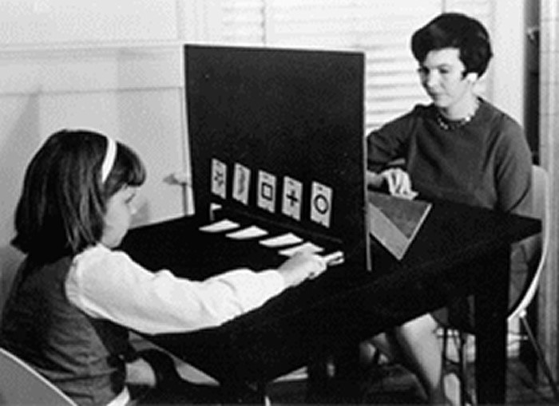

```{r xaringan-themer, include = FALSE}
library(xaringanthemer)
mono_accent(base_color = "#bf67bc") #3E8A83?
```

```{r, include = FALSE}
library(tidyverse)
library(mosaic)
library(moderndive)
library(oibiostat)
library(openintro)
set.seed(12)
data(COL)
knitr::opts_chunk$set(warning = FALSE, message = FALSE, 
                      echo = TRUE, dpi = 300)

theme_set(theme_bw() +
  theme(axis.title.x = element_text(size = 14, face = "bold"), 
        axis.title.y = element_text(size = 14, face = "bold"),
        axis.text.x = element_text(size = 12, face = "bold"), 
        axis.text.y = element_text(size = 12, face = "bold")))

```

<!--
pagedown::chrome_print("~/Dropbox/Teaching/03-Simmons Courses/MATH228-Introduction to Data Science/Lecture Slides/01-Introduction/01-Introduction.html")
-->

class: center, middle, frame

# Module Plan

## Review of .display[Central Limit Theorem]
    
--

## Confidence intervals for .display[single proportion]
  
--

## Hypothesis testing for .display[single proportion]
    
---

class: center, middle, frame

# Central Limit Theorem

---

# Extrasensory Perception (ESP)

One way to test for *extrasensory perception* (ESP) is with Zener cards. 

- **five cards** with a *different symbol on each*

.center[
```{r, echo = FALSE, dpi = 200}

```
]

--

**Question**: If there was **no such thing as ESP**, what *proportion* of guesses should be correct?

---

# Sampling Variability

Suppose we play this game 50 times as a class. Our *proportion* of **correct guesses** is $$\hat{p}=\frac{12}{50}=0.24$$

- Does this provide evidence that ESP is real?

--

**Remember**: Statistics **vary** *from sample to sample*!

--

- We *model* $\hat{p}$ using the **Normal distribution**, provided:
    - sample observations are **independent**
    - sample size is **sufficiently large**

.center[
```{r, echo = FALSE, fig.width = 4, fig.asp = .5, out.width = "55%"}
set.seed(12)
outcomes = c("Correct", "Incorrect")
sampling_dist = do(1000)*tally( ~ resample(outcomes, size = 50, prob = c(0.20, 0.80)), 
                                format = "proportion")[1]
gf_histogram( ~ Correct, binwidth = 0.02, data = sampling_dist) + 
  labs(x = "") +
  theme(axis.text.x = element_blank(), 
        axis.ticks.x = element_blank())
```
]

---

# A Note on Categorical Variables

Whether one guesses a Zener card symbol **correctly** or **incorrectly** is a *categorical variable*. 

Two outcomes: 

1. **Correct**

2. **Incorrect**

```{r, echo = FALSE}
sample(outcomes, 10, replace = TRUE, prob = c(0.2, 0.8))
```


--

The main *outcome of interest* is **Correct**. 

- We'll refer to this as the "success". 

---

# Central Limit Theorem

The **sampling distribution** of $\hat{p}$ is **nearly Normal** when:

1. Sample observations are **independent** (e.g., from a *random sample*).

2. We can expect *at least* 10 "successes" and 10 "failures"
    - Check $n\hat{p}\geq10$ and $n(1-\hat{p})\geq10$
    
--

When these conditions are met, we can estimate the **standard error** of $\hat{p}$ with: $$SE_{\hat{p}}=\sqrt{\frac{\hat{p}(1-\hat{p})}{n}}$$

```{r}
# ESP example
sqrt(0.24*(1-0.24)/50)
```

---

class: center, middle, frame

# Confidence Intervals (for single proportion)

---

# Confidence Intervals

Define $p$ as the **population proportion** of correct Zener card guesses. 

- This is *unknown*, but $\hat{p}=0.24$ serves as a **point estimate**. 

--

A **confidence interval** represents a *range of plausible values* for $p$. 

Using the **Normal distribution**:

- $\hat{p}\pm z^{*}\times SE_{\hat{p}}$

--

The $z^{*}$ value depends on the **confidence level**. 

- 95% is the most common level. 

.center[
```{r, echo = FALSE, fig.height = 3, out.width = "75%"}
par(mar = c(3.3, 1, 0.15, 1), mgp = c(2.1, 0.6, 0))
normTail(M = c(-1.96, 1.96),
         df = 10,
         col = COL[1],
         xlim = 3.3 * c(-1, 1),
         ylim = c(0, 0.59),
         xlab='')
X <- rev(seq(-4, 4, 0.025))
Y <- dt(X, 10) # makes better visual

yMax <- 0.41

lines(1.96*c(-1,1), rep(yMax,2), lwd=2)
lines(rep(-1.96,2), c(0,yMax), lty=2, col=COL[6])
lines(rep( 1.96,2), c(0,yMax), lty=2, col=COL[6])
text(0, yMax, '95%, extends -1.96 to 1.96', pos=3)
```
]

---

# Putting it all together

For the ESP example:

- $n=50$
- $\hat{p}=12/50=0.24$
    - 12 **successes**, 38 **failures**
    
(Is the sample *random*?)
    
--
    
- $SE_{\hat{p}}=0.06$

--

**95% confidence interval**

```{r}
0.24 - 1.96*0.06
0.24 + 1.96*0.06
```

--

**Interpretation**: We are *95% confident* that the *population proportion* of correct Zener card guesses is between 12.2% and 35.8%. 

---

# Changing Confidence Level

What if we want to be **more confident** in capturing the population proportion in our interval?

- Wider interval?
- Smaller interval?

--

.center[
```{r, echo = FALSE, fig.height = 3, out.width = "75%"}
par(mar = c(3.3, 1, 0.15, 1), mgp = c(2.1, 0.6, 0))
normTail(M = c(-1.96, 1.96),
         df = 10,
         col = COL[1],
         xlim = 3.3 * c(-1, 1),
         ylim = c(0, 0.59),
         xlab='')
X <- rev(seq(-4, 4, 0.025))
Y <- dt(X, 10) # makes better visual

yMax <- 0.41

these <- (-2.58 < X & X < 2.58)
x <- c(2.58, X[these], -2.58)
y <- c(0, dt(X[these], 10), 0)
polygon(x, y, col=COL[1,3], border='#00000000')

lines(1.96*c(-1,1), rep(yMax,2), lwd=2)
lines(rep(-1.96,2), c(0,yMax), lty=2, col=COL[6])
lines(rep( 1.96,2), c(0,yMax), lty=2, col=COL[6])
text(0, yMax, '95%, extends -1.96 to 1.96', pos=3)

yMax <- 0.53
lines(2.58*c(-1,1), rep(yMax,2), lwd=2)
lines(rep(-2.58,2), c(0,yMax), lty=2, col='#00000055')
lines(rep( 2.58,2), c(0,yMax), lty=2, col='#00000055')
text(0, yMax, '99%, extends -2.58 to 2.58', pos=3)
```
]

--

**99% confidence interval**

```{r}
c(0.24 - 2.58*0.06, 0.24 + 2.58*0.06)
```

---

# Changing Confidence Level

What if we want to be **more confident** in capturing the population proportion in our interval?

- Wider interval?
- Smaller interval?

--

.pull-left[
```{r, echo = FALSE, fig.height = 3}
par(mar = c(3.3, 1, 0.15, 1), mgp = c(2.1, 0.6, 0))
normTail(M = c(-1.645, 1.645),
         df = 10,
         col = COL[1],
         xlim = 3.3 * c(-1, 1),
         ylim = c(0, 0.59),
         xlab='')
X <- rev(seq(-4, 4, 0.025))
Y <- dt(X, 10) # makes better visual

yMax <- 0.41

lines(1.645*c(-1,1), rep(yMax,2), lwd=2)
lines(rep(-1.645,2), c(0,yMax), lty=2, col=COL[6])
lines(rep( 1.645,2), c(0,yMax), lty=2, col=COL[6])
text(0, yMax, '90%, extends -1.645 to 1.645', pos=3)

these <- (-1.96 < X & X < 1.96)
x <- c(1.96, X[these], -1.96)
y <- c(0, dt(X[these], 10), 0)
polygon(x, y, col=COL[1,3], border='#00000000')

yMax <- 0.53
lines(1.96*c(-1,1), rep(yMax,2), lwd=2)
lines(rep(-1.96,2), c(0,yMax), lty=2, col='#00000055')
lines(rep( 1.96,2), c(0,yMax), lty=2, col='#00000055')
text(0, yMax, '95%, extends -1.96 to 1.96', pos=3)
```
]

.pull-right[
You can use `qnorm()` to find these *Normal quantiles* in R:

```{r}
val = 1 - (1-0.90)/2 # For 90% CI
qnorm(val)
```
]

--

**90% confidence interval**

```{r}
c(0.24 - 1.645*0.06, 0.24 + 1.645*0.06)
```

---

# Changing Sample Size

What if we kept the **confidence level** at 95%, but *increased the sample size* from 50 to 250?
- We'll keep $\hat{p}$ the same, $60/250=0.24$

--

- The *only thing* that would change is the **standard error**: $$SE_{\hat{p}}=\sqrt{\frac{\hat{p}(1-\hat{p})}{n}}$$

```{r}
sqrt(0.24*(1-0.24)/250)
```

--

**95% Confidence Interval** (with larger *sample size*):

```{r}
c(0.24 - 1.96*0.027, 0.24 + 1.96*0.027)
```

---

# Recap

**90% Confidence Interval**, $n=50$

```{r}
c(0.24 - 1.645*0.06, 0.24 + 1.645*0.06)
```

**95% Confidence Interval**, $n=50$

```{r}
c(0.24 - 1.96*0.06, 0.24 + 1.96*0.06)
```

**99% Confidence Interval**, $n=50$

```{r}
c(0.24 - 2.58*0.06, 0.24 + 2.58*0.06)
```


---

# Recap

**95% Confidence Interval**, $n=50$

```{r}
c(0.24 - 1.96*0.06, 0.24 + 1.96*0.06)
```

**95% Confidence Interval**, $n=250$

```{r}
c(0.24 - 1.96*0.027, 0.24 + 1.96*0.027)
```

**95% Confidence Interval**, $n=1000$

```{r}
c(0.24 - 1.96*0.014, 0.24 + 1.96*0.014)
```

---

class: center, middle, frame

# Hypothesis Testing (for single proportion)

---

# Competing Hypotheses

**Recall**: Statistical hypothesis testing involves two competing claims about the *population*:

- $H_{0}$ (**Null** hypothesis): position of *no difference*

- $H_{A}$ (**Alternative** hypothesis): usually a *new* or *stronger* perspective

--

**ESP Example**:

- $H_{0}: p=1/5=0.20$
    - There is no such thing as ESP - your chances of guessing a card symbol correctly are *entirely random*.

- $H_{A}: p>0.20$
    - There is some evidence that some might be able to guess a card symbol correctly at a rate *higher than random*. 
    
--

We'll play the role of the **skeptic**. Assume $H_{0}$ until there is *convincing evidence* that it is false. 

---

# Assuming the Null

By initially assuming the *null hypothesis*, we are assuming the following:

- $p=p_{0}=0.20$

- $SD(\hat{p})=\sqrt{p(1-p)/n}=0.057$, using $n=50$

--

By the **CLT**, the distribution of $\hat{p}$ under the *null hypothesis* is **Normal**:

.center[
```{r, echo = FALSE, fig.height = 4, out.width = "65%"}
samp = data.frame(var = rnorm(10000, 0.20, sqrt(0.2*0.8/50)))
gf_density( ~ var, data = samp) + 
  geom_histogram(binwidth = 0.02, alpha = 0.3, fill = "blue") + 
  labs(x = expression(hat(p)),
       y = "",
       title = "Null Distribution", 
       subtitle = "Assuming p = 0.20") + 
  theme(axis.text.y = element_blank(), 
        axis.ticks.y = element_blank())
```
]

---

# Judging Evidence

Our "evidence":

- One sample of $n=50$, with $\hat{p}=0.24$

--

.center[
```{r, echo = FALSE, fig.height = 4, out.width = "65%"}
gf_density( ~ var, data = samp) + 
  geom_histogram(binwidth = 0.02, alpha = 0.3, fill = "blue") + 
  geom_vline(xintercept = 0.24, color = "red") +
  labs(x = expression(hat(p)),
       y = "",
       title = "Null Distribution", 
       subtitle = "Assuming p = 0.20") + 
  theme(axis.text.y = element_blank(), 
        axis.ticks.y = element_blank())
```
]

Is our "evidence" a *rare event* in this distribution?

--

- What is the **probability** of $\hat{p}$ being *greater* than 0.24 in this distribution?

---

# Reviewing pnorm()

The `pnorm()` R function gives Normal **tail areas**. This is what we need!

.center[
```{r, echo = FALSE, fig.height = 4, out.width = "55%"}
gf_density( ~ var, data = samp) + 
  geom_histogram(binwidth = 0.02, alpha = 0.3, fill = "blue") + 
  geom_vline(xintercept = 0.24, color = "red") +
  labs(x = expression(hat(p)),
       y = "",
       title = "Null Distribution", 
       subtitle = "Assuming p = 0.20") + 
  theme(axis.text.y = element_blank(), 
        axis.ticks.y = element_blank())
```
]

--

In this distribution: `mean = 0.2`, `sd = 0.057` (calculated earlier)

```{r}
1 - pnorm(0.24, mean = 0.2, sd = 0.057)
```

- **Note**: Using `1-pnorm()` gives the **upper** Normal tail area. 

---

# p-value

```{r}
1 - pnorm(0.24, mean = 0.2, sd = 0.057)
```

There is a 24% chance of observing data *more extreme* than $\hat{p}=0.24$, **in a world where the null hypothesis is true**. 

--

- That's the **p-value**!
    - Because p-value $>0.05$, **we fail to reject** the null hypothesis. 

--

We also have the **95% confidence interval** from before:

```{r}
c(0.24 - 1.96*0.06, 0.24 + 1.96*0.06)
```

.center[
```{r, echo = FALSE, fig.width = 5, fig.asp = .32, out.width = "60%"}
data.frame(range = seq(0, 1, 0.01)) %>%
  ggplot(aes(x = range)) + 
  geom_blank() + 
  annotate("point", x = 0.24, y = 0.25, size = 3) + 
  geom_segment(y = 0.25, yend = 0.25, 
               x = 0.1224, xend = 0.3576, 
               color = "red", lty = 2) + 
  geom_vline(xintercept = 0.20, color = "blue") +
  scale_x_continuous(labels = scales::percent_format(accuracy = 1), limits = c(0.05, 0.5)) +
  theme_minimal() + 
  labs(x = "", y = "", title = "95% Confidence Interval for p") + 
  theme(axis.title.y = element_blank(),
        axis.text.y = element_blank(),
        axis.ticks.y = element_blank(), 
        axis.text.x = element_text(size = 12, face = "bold"))
```
]

---

# Test Statistic

We typically **standardize** our "evidence" to the **standard Normal** scale. 

The **test statistic**, $Z$, is a $z$-score: $$Z=\frac{\text{point estimate} - \text{null value}}{SD(\hat{p})} = \frac{0.24-0.20}{0.057} = 0.702$$

--

```{r}
Z = (0.24-0.20)/sqrt(0.20*(1-0.20)/50)
Z
```

--

.pull-left[
```{r, echo = FALSE, fig.height = 4}
gf_density( ~ var, data = samp) + 
  geom_histogram(binwidth = 0.02, alpha = 0.3, fill = "blue") + 
  geom_vline(xintercept = 0.24, color = "red") +
  labs(x = expression(hat(p)),
       y = "",
       title = "Null Distribution (assuming p = 0.20)") + 
  theme(axis.text.y = element_blank(), 
        axis.ticks.y = element_blank())
```
]

.pull-right[
```{r, echo = FALSE, fig.height = 4}
samp$z = zscore(samp$var)
gf_density( ~ z, data = samp) + 
  geom_histogram(binwidth = 0.2, alpha = 0.3, fill = "blue") + 
  geom_vline(xintercept = 0.7107544, color = "red") + 
  labs(x = "Z", y = "",
       title = "Standardized Null Distribution") + 
  theme(axis.text.y = element_blank(), 
        axis.ticks.y = element_blank())
```
]

---

# Test Statistic

.center[
```{r, echo = FALSE, fig.height = 4, out.width = "65%"}
samp$z = zscore(samp$var)
gf_density( ~ z, data = samp) + 
  geom_histogram(binwidth = 0.2, alpha = 0.3, fill = "blue") + 
  geom_vline(xintercept = 0.7107544, color = "red") + 
  labs(x = "Z", y = "",
       title = "Standardized Null Distribution") + 
  theme(axis.text.y = element_blank(), 
        axis.ticks.y = element_blank())
```
]

**p-value** (with `mean = 0` and `sd = 1`)

```{r}
1 - pnorm(0.702)
```

--

**Conclusion**: *Fail to reject* $H_{0}$. Not enough evidence to conclude that ESP is real. 