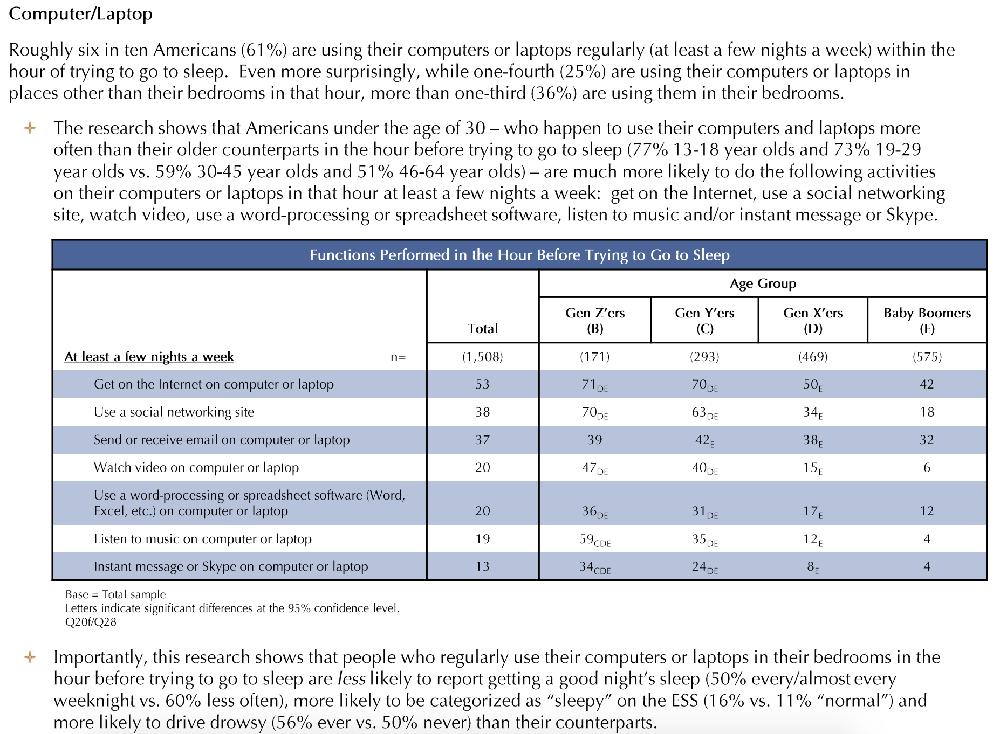

```{r xaringan-themer, include = FALSE}
library(xaringanthemer)
mono_accent(base_color = "#bf67bc") #3E8A83?
```

```{r, include = FALSE}
library(tidyverse)
library(mosaic)
library(moderndive)
library(oibiostat)
library(openintro)
set.seed(12)
data(COL)
knitr::opts_chunk$set(warning = FALSE, message = FALSE, 
                      echo = TRUE, dpi = 300)

theme_set(theme_bw() +
  theme(axis.title.x = element_text(size = 14, face = "bold"), 
        axis.title.y = element_text(size = 14, face = "bold"),
        axis.text.x = element_text(size = 12, face = "bold"), 
        axis.text.y = element_text(size = 12, face = "bold")))
```

<!--
pagedown::chrome_print("~/Dropbox/Teaching/03-Simmons Courses/MATH228-Introduction to Data Science/Lecture Slides/01-Introduction/01-Introduction.html")
-->

class: center, middle, frame

# Module Plan

## Comparing .display[groups]

--

## Confidence intervals for .display[two proportions]
  
--

## Hypothesis testing for .display[two proportions]
    
---

class: center, middle, frame

# Comparing Groups

---

# Technology Before Sleep

[2011 National Sleep Foundation Report](https://www.sleepfoundation.org/professionals/sleep-americar-polls/2011-poll-technology-and-sleep)

.center[
```{r, echo = FALSE}

```
]

---

# Technology Before Sleep

- 293 gen-Y respondents: **205 (70%)** reported regularly using technology before trying to going to sleep. 
    - $n_{y}=293$, $\hat{p}_{y}=0.70$

- 469 gen-X respondents: **235 (50%)** reported regularly using technology before trying to going to sleep. 
    - $n_{x}=469$, $\hat{p}_{x}=0.50$
    
--

**Question**: Is there *statistical evidence* that more gen-Yers use technology before bed than gen-Xers?

--

- Confidence intervals for the **difference in proportions**

- Hypothesis testing for the **difference in proportions**

---

# Point Estimate

When *comparing two groups*, the point estimate is the **difference between proportions**. 

- $\hat{p}_{y}-\hat{p}_{x}=0.70-0.50=0.20$

--

**Interpretation**: *In the sample*, 20% *more gen-Yers* used technology before going to bed than *gen-Xers*. 

- But **samples vary**!

--

.pull-left[
```{r, echo = FALSE, fig.width = 5, fig.asp = .32}
data.frame(range = seq(0, 1, 0.01)) %>%
  ggplot(aes(x = range)) + 
  geom_blank() + 
  annotate("point", x = 0.20, y = 0.25, size = 3) + 
  scale_x_continuous(labels = scales::percent_format(accuracy = 1), limits = c(0.1, 0.3)) +
  theme_minimal() + 
  labs(x = "", y = "", title = "Point Estimate") + 
  theme(axis.title.y = element_blank(),
        axis.text.y = element_blank(),
        axis.ticks.y = element_blank(), 
        axis.text.x = element_text(size = 12, face = "bold"))
```
]

.pull-right[
```{r, echo = FALSE, fig.width = 5, fig.asp = .32}
data.frame(range = seq(0, 1, 0.01)) %>%
  ggplot(aes(x = range)) + 
  geom_blank() + 
  annotate("point", x = 0.20, y = 0.25, size = 3) + 
  geom_segment(y = 0.25, yend = 0.25, 
               x = 0.1314, xend = 0.2686, 
               color = "red", lty = 2) + 
  scale_x_continuous(labels = scales::percent_format(accuracy = 1), limits = c(0.1, 0.3)) +
  theme_minimal() + 
  labs(x = "", y = "", title = "Point Estimate (plus 95% Confidence Interval)") + 
  theme(axis.title.y = element_blank(),
        axis.text.y = element_blank(),
        axis.ticks.y = element_blank(), 
        axis.text.x = element_text(size = 12, face = "bold"))
```
]

---

class: center, middle, frame

# Confidence Intervals (for two proportions)

---

# Many (Simulated) Samples

Let's **assume** for a moment that...

- 48% of **all** gen-Xers use technology before sleep
- 73% of **all** gen-Yers use technology before sleep

Under this *assumption*, let's simulate taking *many* samples from the population, and calculating their **difference in proportions**:

--

.center[
```{r, echo = FALSE, out.width = "45%"}
set.seed(118)
outcomes = c("No", "Yes")
sampling_dist_X = do(1000)*tally( ~ resample(outcomes, size = 469, prob = c(0.52, 0.48)), 
                                  format = "proportion")[2]
sampling_dist_Y = do(1000)*tally( ~ resample(outcomes, size = 293, prob = c(0.27, 0.73)), 
                                  format = "proportion")[2]
sampling_dist_Y$diff = sampling_dist_Y$Yes - sampling_dist_X$Yes
gf_histogram( ~ diff, data = sampling_dist_Y) + 
  labs(x = "Difference in Sample Proportions")
```
]

---

# Sampling Distributions

.pull-left[
```{r, echo = FALSE}
gf_histogram( ~ diff, data = sampling_dist_Y) + 
  labs(x = "Difference in Sample Proportions")
```
]

.pull-right[
- Centered at **0.25**

- Nearly **Normal**

- Standard deviation of **0.031** 
]

--

But... provided the **conditions** are met, we have the **Central Limit Theorem**. 

---

# Central Limit Theorem (CLT)

When:
- observations are **independent**, and
- the *sample sizes* are **sufficiently large**, 

the difference in sample proportion, $\hat{p}_{y}-\hat{p}_{x}$, will follow a **Normal distribution** with *mean* and *standard deviation* given by: $$\mu_{\hat{p}_{y}-\hat{p}_{x}}=p_{y}-p_{x}\quad\text{and}\quad SD_{\hat{p}_{y}-\hat{p}_{x}}=\sqrt{\frac{p_{y}(1-p_{y})}{n_{y}} + \frac{p_{x}(1-p_{x})}{n_{x}}}$$

--

Using $n_{y}=293$ and $n_{x}=469$, with $p_{y}=0.73$ and $p_{x}=0.48$, 

```{r}
0.73-0.48 # Mean

sqrt(0.48*0.52^2/469 + 0.73*0.27/293) # SD
```

---

# Standard Error

**Remember**, population *parameters* are **unknown**. 

- Estimate $SD_{\hat{p}_{y}-\hat{p}_{x}}$ with $SE_{\hat{p}_{y}-\hat{p}_{x}}$: $$SE_{\hat{p}_{y}-\hat{p}_{x}}=\sqrt{\frac{\hat{p}_{y}(1-\hat{p}_{y})}{n_{y}} + \frac{\hat{p}_{x}(1-\hat{p}_{x})}{n_{x}}}$$

--

Using $\hat{p}_{y}=0.70$ and $\hat{p}_{x}=0.50$, 

```{r}
sqrt(0.50*0.50/469 + 0.70*0.30/293) # SE
```

---

# 95% Confidence Intervals

Similar to CIs for a *single proportion*: $$\text{point estimate}\pm 1.96*SE$$

--

For a **difference between proportions**: $$(\hat{p}_{y}-\hat{p}_{x})\pm 1.96*\sqrt{\frac{\hat{p}_{x}(1-\hat{p}_{x})}{n_{x}} + \frac{\hat{p}_{x}(1-\hat{p}_{x})}{n_{x}}}$$

- **Point estimate**: $\hat{p}_{y}-\hat{p}_{x}=0.20$

- **Standard error**: $SE_{\hat{p}_{y}-\hat{p}_{x}}=0.035$

--

```{r}
c(0.20 - 1.96*0.035, 0.20 + 1.96*0.035)
```

---

# Interpreting Confidence Intervals

```{r}
c(0.20 - 1.96*0.035, 0.20 + 1.96*0.035)
```

.center[
```{r, echo = FALSE, fig.width = 5, fig.asp = .32, out.width = "65%"}
data.frame(range = seq(0, 1, 0.01)) %>%
  ggplot(aes(x = range)) + 
  geom_blank() + 
  annotate("point", x = 0.20, y = 0.25, size = 3) + 
  geom_segment(y = 0.25, yend = 0.25, 
               x = 0.1314, xend = 0.2686, 
               color = "red", lty = 2) + 
  scale_x_continuous(labels = scales::percent_format(accuracy = 1), limits = c(0.1, 0.3)) +
  theme_minimal() + 
  labs(x = "", y = "", title = "Point Estimate (plus 95% Confidence Interval)") + 
  theme(axis.title.y = element_blank(),
        axis.text.y = element_blank(),
        axis.ticks.y = element_blank(), 
        axis.text.x = element_text(size = 12, face = "bold"))
```
]

- We are **95% confident** that between 13.1% and 26.9% **more** gen-Yers use technology before going to bed than gen-Xers. 

--

**Question**: Does this provide *convincing* evidence that more gen-Yers use technology before going to bed than gen-Xers?

---

class: center, middle, frame

# Hypothesis Testing (for two proportions)

---

# Stating the Hypotheses

When comparing *two proportions*, the **null** and **alternative** hypotheses will be statements about **two** population proportions:

- $H_{0}$ (**Null** hypothesis): $p_{1}-p_{2}=0$, or $p_{1}=p_{2}$

- $H_{A}$ (**Alternative** hypothesis): $p_{1}-p_{2}\neq0$ (or $>$, $<$), or $p_{1}\neq p_{2}$

--

In the [technology before sleep](https://www.sleepfoundation.org/professionals/sleep-americar-polls/2011-poll-technology-and-sleep) example:

- $H_{0}$: **No difference** in technology use before bed for gen-Y and gen-X.
    - $p_{y}-p_{x}=0$

- $H_{A}$: Gen-Y has a **higher proportion** of technology use before bed.
    - $p_{y}-p_{x}>0$, or $p_{y}>p_{x}$

--

We'll play the role of the **skeptic**. Assume $H_{0}$ until there is *convincing evidence* that it is false. 

---

# Assuming the Null

By initially assuming the *null hypothesis*, we are assuming the following:

- $p_{y}-p_{x}=0$ (*Generation* and *bedtime technology use* are **independent**.)

--

We can **simulate** the *null distribution* by randomly shuffling study respondents into generation groups:

.pull-left[
**Observed data**
```{r, echo = FALSE}
gen_data = data.frame(tech_use = c("Yes", "Yes", "No", "No", "Yes", "Yes", "No", "..."),
                      generation = c("Y", "X", "Y", "X", "Y", "Y", "X", "..."))
knitr::kable(gen_data, format = "html")
```
]

--

.pull-right[
**Pre-shuffled data**
```{r, echo = FALSE}
gen_data = data.frame(tech_use = c("Yes", "Yes", "No", "No", "Yes", "Yes", "No", "..."),
                      generation = c("?", "?", "?", "?", "?", "?", "?", "..."))
knitr::kable(gen_data, format = "html")
```
]

---

# Simulating the Null Distribution

What would a **sampling distribution** of $\hat{p}_{y}-\hat{p}_{x}$ look like...
- if $p_{y}=p_{x}$?

--

```{r, echo = FALSE}
set.seed(12)
gen_data = data.frame(generation = c(rep("X", 469), rep("Y", 293)), 
                      tech_use = c(rep("Yes", 235), rep("No", 234), 
                                   rep("Yes", 205), rep("No", 88)))
```

```{r}
diffprop(tech_use ~ shuffle(generation), data = gen_data)
```

--

```{r}
diffprop(tech_use ~ shuffle(generation), data = gen_data)
```

--

```{r}
diffprop(tech_use ~ shuffle(generation), data = gen_data)
```

---

# The Null Distribution

We repeat *shuffling* and calculating the *difference in proportions* in bedtime technology use between gen-Y and gen-X to obtain a **null distribution**. 

.pull-left[
```{r, echo = FALSE}
gen_null <- do(1000) * diffprop(tech_use ~ shuffle(generation), data = gen_data)
#sum(gen_null$diffprop >= 0.2)/1000
gf_histogram(~ diffprop, data = gen_null) + 
  labs(x = "Difference in Proportions of bedtime technology use", 
       title = "Gen-Y vs Gen-X", 
       subtitle = "Null Distribution: 1,000 simulations") + 
  geom_vline(xintercept = 0.20, color = "red")
```
]

--

.pull-right[
- Centered at **zero**

- Approximately **Normal**

In 1,000 simulations, 0 (!!!) yielded a *point estimate* $\geq0.20$. 
]

---

# Back to the CLT

Provided the conditions are met:
- By the **CLT**, the **null distribution** is **Normal** and centered at 0!

.center[
```{r, echo = FALSE, fig.height = 4, out.width = "65%"}
samp = data.frame(var = rnorm(10000, 0, 0.03605473))
gf_density( ~ var, data = samp) + 
  geom_histogram(data = gen_null, aes(x = diffprop), 
                 binwidth = 0.02, alpha = 0.3, fill = "blue") + 
  labs(x = expression(hat(p)[y] - hat(p)[x]),
       y = "",
       title = "Null Distribution", 
       subtitle = "Assuming Independence") + 
  geom_vline(xintercept = 0.20, color = "red") +
  theme(axis.text.y = element_blank(), 
        axis.ticks.y = element_blank())
```
]

---

# Judging Evidence

Our "evidence":

- With $n_{y}=293$ gen-Yers and $n_{x}=469$ gen-Xers, an *estimated* 20% *more* gen-Yers use technology before going to bed. 

--

.center[
```{r, echo = FALSE, fig.height = 4, out.width = "65%"}
samp = data.frame(var = rnorm(10000, 0, 0.03605473))
gf_density( ~ var, data = samp) + 
  geom_histogram(data = gen_null, aes(x = diffprop), 
                 binwidth = 0.02, alpha = 0.3, fill = "blue") + 
  labs(x = expression(hat(p)[y] - hat(p)[x]),
       y = "",
       title = "Null Distribution", 
       subtitle = "Assuming Independence") + 
  geom_vline(xintercept = 0.20, color = "red") +
  theme(axis.text.y = element_blank(), 
        axis.ticks.y = element_blank())
```
]

The **probability** of observing a *difference in proportions* more extreme than 0.20 is **near zero**. 

- **p-value** = 0 (usually we say "< 0.001")

---

# Test Statistic

Similar to analyzing *one proportion*...

- We typically **standardize** our "evidence" so that it's on a **standard Normal** scale.

The **test statistic**, $Z$, is a $z$-score: $$Z=\frac{\text{point estimate} - \text{null value}}{SE}=\frac{0.20-0}{0.035}=5.66$$

--

```{r}
Z = (0.20-0)/sqrt(0.50*0.50/469 + 0.70*0.30/293) 
Z
```

---

# Conclusion

.pull-left[
```{r, echo = FALSE, fig.height = 5}
z_data = data.frame(z = rnorm(10000))
gf_density( ~ z, data = z_data) + 
  geom_histogram(binwidth = 0.2, alpha = 0.3, fill = "blue") + 
  geom_vline(xintercept = 5.66, color = "red") + 
  labs(x = "Z", y = "",
       title = "Standardized Null Distribution") + 
  theme(axis.text.y = element_blank(), 
        axis.ticks.y = element_blank())
```

]

.pull-right[
```{r}
1-pnorm(5.66)
```

- p-value $<0.05$, so **reject the null hypothesis**. 

- We have evidence to conclude that a *higher proportion* of gen-Yers use technology before bed than gen-Xers. 
]

--

Don't forget **confidence intervals**!:

.center[
```{r, echo = FALSE, fig.width = 5, fig.asp = .32, out.width = "65%"}
data.frame(range = seq(0, 1, 0.01)) %>%
  ggplot(aes(x = range)) + 
  geom_blank() + 
  annotate("point", x = 0.20, y = 0.25, size = 3) + 
  geom_segment(y = 0.25, yend = 0.25, 
               x = 0.1314, xend = 0.2686, 
               color = "red", lty = 2) + 
  scale_x_continuous(labels = scales::percent_format(accuracy = 1), limits = c(0.1, 0.3)) +
  theme_minimal() + 
  labs(x = expression(hat(p)[y] - hat(p)[x]), y = "", title = "Estimated Difference in Proportions: 20%", 
       subtitle = "95% Confidence Interval: (13.1%, 26.9%)") + 
  theme(axis.title.y = element_blank(),
        axis.text.y = element_blank(),
        axis.ticks.y = element_blank(), 
        axis.text.x = element_text(size = 12, face = "bold"))
```
]


