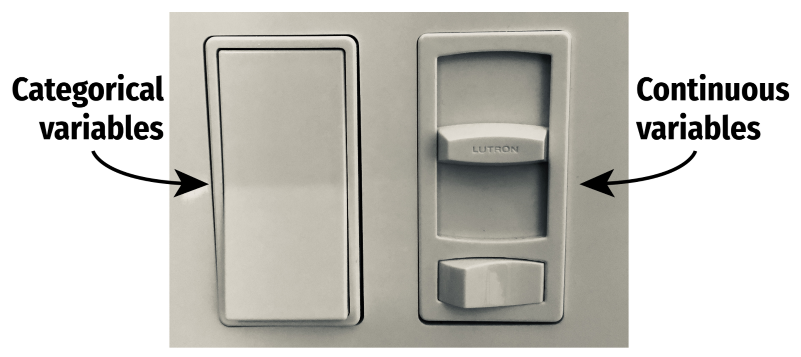
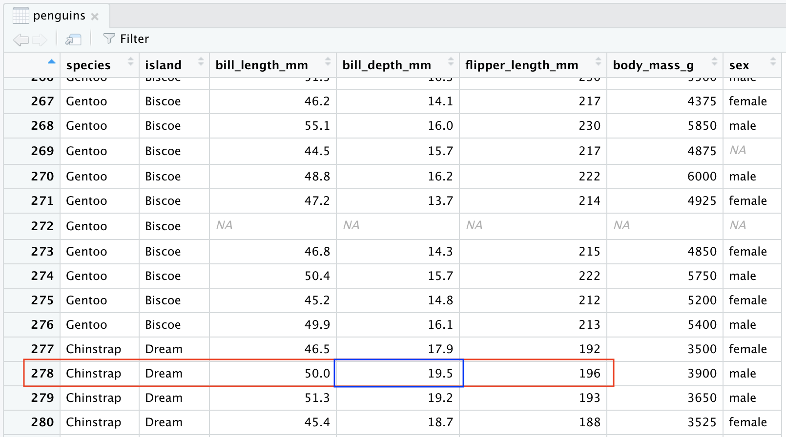

```{r xaringan-themer, include = FALSE}
library(xaringanthemer)
mono_accent(base_color = "#bf67bc") #3E8A83?
```

```{r, include = FALSE}
library(tidyverse)
library(mosaic)
library(moderndive)
library(nycflights13)
library(openintro)
library(palmerpenguins)
library(broom)
set.seed(12)
data(COL)
knitr::opts_chunk$set(warning = FALSE, message = FALSE, 
                      echo = TRUE, dpi = 300)

theme_set(theme_minimal() +
  theme(axis.title.x = element_text(size = 14, face = "bold"), 
        axis.title.y = element_text(size = 14, face = "bold"),
        axis.text.x = element_text(size = 12, face = "bold"), 
        axis.text.y = element_text(size = 12, face = "bold")))
```

<!--
pagedown::chrome_print("~/Dropbox/Teaching/03-Simmons Courses/MATH228-Introduction to Data Science/Lecture Slides/01-Introduction/01-Introduction.html")
-->

class: center, middle, frame

# Module Plan

## Modeling .display[multiple] variables

--

## .display[Categorical] predictors
    
--

## .display[Building] multiple regression models

--

## .display[Interpreting] multiple regression models
    
---

class: center, middle, frame

# Modeling Multiple Variables

---

# Basic vs Multiple Regression

.pull-left[
**Basic regression**

- *two* variables: *y* and *x*

- describes relationship between an **outcome** and a *single* **predictor** variable

- $\hat{y}=\beta_{0}+\beta_{1}x_{1}$

```{r, echo = FALSE, fig.asp = 0.5}
gf_point(bill_depth_mm ~ bill_length_mm, data = penguins) + 
  labs(x = "Bill length (mm)", y = "Bill depth (mm)") + 
  geom_smooth(method = "lm", se = FALSE) 
```
]

--

.pull-right[
**Multiple regression**

- *many* variables: *y*, $x_{1}$, $x_{2}$, ...

- describes relationship between an **outcome** and a *multiple* **predictor** variables

- $\hat{y}=\beta_{0}+\beta_{1}x_{1}+\beta_{2}x_{2}+\cdots$

```{r, echo = FALSE, fig.asp = 0.5}
gf_point(bill_depth_mm ~ bill_length_mm, color = ~species, data = penguins) + 
  geom_smooth(aes(color = species), method = "lm", se = FALSE) +
  labs(x = "Bill length (mm)", y = "Bill depth (mm)", color = "Penguin species") + 
  scale_color_manual(values = c("darkorange","purple","cyan4")) +
  theme_minimal() +
  theme(legend.position = c(0.8, 0.15),
        legend.background = element_rect(fill = "white", color = NA),
        plot.title.position = "plot",
        plot.caption = element_text(hjust = 0, face = "italic"),
        plot.caption.position = "plot", 
        axis.title.x = element_text(size = 14, face = "bold"), 
        axis.title.y = element_text(size = 14, face = "bold"),
        axis.text.x = element_text(size = 12, face = "bold"), 
        axis.text.y = element_text(size = 12, face = "bold"))
```
]

---

# Penguins!

Relationship between **bill length** and **bill depth**

- [Source](https://github.com/allisonhorst/palmerpenguins): Palmer Station, Antarctica

.center[
```{r, echo = FALSE, out.width = "75%", fig.asp = 0.5}
gf_point(bill_depth_mm ~ bill_length_mm, data = penguins) + 
  labs(x = "Bill length (mm)", y = "Bill depth (mm)") 
```
]

.pull-left[
```{r, echo = FALSE}
knitr::include_graphics("palmerpenguins_hex.png")
```
]

---

# More than two variables

.pull-left[
```{r, echo = FALSE}
knitr::include_graphics("penguins.png")
```
]

.pull-right[
```{r, echo = FALSE}
gf_point(bill_depth_mm ~ bill_length_mm, color = ~species, data = penguins) + 
  geom_smooth(aes(color = species), method = "lm", se = FALSE) +
  labs(x = "Bill length (mm)", y = "Bill depth (mm)", color = "Penguin species") + 
  scale_color_manual(values = c("darkorange","purple","cyan4")) +
  theme_minimal() +
  theme(legend.position = c(0.8, 0.15),
        legend.background = element_rect(fill = "white", color = NA),
        plot.title.position = "plot",
        plot.caption = element_text(hjust = 0, face= "italic"),
        plot.caption.position = "plot", 
        axis.title.x = element_text(size = 14, face = "bold"), 
        axis.title.y = element_text(size = 14, face = "bold"),
        axis.text.x = element_text(size = 12, face = "bold"), 
        axis.text.y = element_text(size = 12, face = "bold"))
```
]

.footnote[
[*] Artwork by @allison_horst
]

---

# Why multiple regression?

It is **rare** to have a *single* predictor (*x*) variable in a study!

- The **multiple regression model** is of the form: $$\hat{y}=\beta_{0}+\beta_{1}x_{1}+\beta_{2}x_{2}+\cdots+\beta_{k}x_{k}$$ where there are *k* predictor variables in the study. 

--

.pull-left[
```{r, echo = FALSE, fig.asp = 0.5}
gf_point(bill_depth_mm ~ bill_length_mm, color = ~species, data = penguins) + 
  geom_smooth(aes(color = species), method = "lm", se = FALSE) +
  labs(x = "Bill length (mm)", y = "Bill depth (mm)", color = "Penguin species") + 
  scale_color_manual(values = c("darkorange","purple","cyan4")) +
  theme_minimal() +
  theme(legend.position = c(0.8, 0.15),
        legend.background = element_rect(fill = "white", color = NA),
        plot.title.position = "plot",
        plot.caption = element_text(hjust = 0, face= "italic"),
        plot.caption.position = "plot", 
        axis.title.x = element_text(size = 14, face = "bold"), 
        axis.title.y = element_text(size = 14, face = "bold"),
        axis.text.x = element_text(size = 12, face = "bold"), 
        axis.text.y = element_text(size = 12, face = "bold"))
```
]

.pull-right[
**Multiple regression model** 

- for *bill depth*: $$\begin{aligned}\widehat{bill\ depth}=&\beta_{0}+\beta_{1}(bill\ length)\\&+\beta_{2}(species)\end{aligned}$$
]

---

class: center, middle, frame

# Categorical Predictors 

## (with more than two levels)

---

# Reviewing Indicators

.pull-left[
```{r, echo = FALSE}
penguins %>% 
  na.omit() %>%
  mutate(sex_ind = ifelse(sex == "female", 0, 1)) %>%
  ggplot(aes(x = sex_ind, y = bill_depth_mm)) + 
  geom_point() + 
  geom_smooth(method = "lm", se = FALSE) +
  scale_x_continuous(breaks = c(0, 1), labels = c("0 (female)", "1 (male)")) +
  labs(x = "Sex of penguin", y = "Bill depth (mm)")
```
]

.pull-right[

$\widehat{bill\ depth}=16.4+1.47(sex_{male})$

- **slope**, $\beta_{1}$: Average change in the Y between the two categories

- **intercept**, $\beta_{0}$: Estimated value of Y for the *first* category (with indicator of 0)
]

---

# Categorical Predictors (with more than two levels)

Suppose instead we fit a model with `species`, which has **three levels**. $$\widehat{bill\ depth}=\beta_{0}+\beta_{1}(species)$$

.center[
```{r, echo = FALSE, fig.asp = 0.5}
ggplot(penguins, aes(x = bill_depth_mm, y = species, color = species)) + 
  geom_jitter() + 
  labs(x = "Bill depth (mm)", y = "Penguin species") + 
  coord_flip() + 
  scale_color_manual(values = c("darkorange","purple","cyan4")) +
  theme_minimal() + 
  theme(legend.position = "none", 
        axis.title.x = element_text(size = 14, face = "bold"), 
        axis.title.y = element_text(size = 14, face = "bold"),
        axis.text.x = element_text(size = 12, face = "bold"), 
        axis.text.y = element_text(size = 12, face = "bold"))
```
]

---

# Model Fitting in R

$\widehat{bill\ depth}=\beta_{0}+\beta_{1}(species)$

```{r}
species_model = lm(bill_depth_mm ~ species, data = penguins)
library(moderndive)
get_regression_table(species_model)
```

--

Write the model like this: $$\widehat{bill\ depth}=18.3+0.0742(species_{chinstrap})-3.36(species_{gentoo})$$

--

What happened to Adelie penguins?

- This is the **reference level**. Coefficients listed for other species are *relative to Adelie penguins*. 

---

class: center, middle, frame

# Building Multiple Regression Models

---

# Multiple Predictors

Now let's build a **multiple regression model**: $$\widehat{bill\ depth}=\beta_{0}+\beta_{1}(bill\ length)+\beta_{2}(species)$$

--

```{r}
multiple_model = lm(bill_depth_mm ~ bill_length_mm + species, 
                    data = penguins)
get_regression_table(multiple_model)
```

--

$$
\begin{aligned}
\widehat{bill\ depth}=&\ 10.6+0.2(bill\ length) \\
&-1.93(species_{chinstrap})-5.11(species_{gentoo})
\end{aligned}
$$
---

# Adding More Variables

Are any other variables *associated* with Penguin bill depth?

- How about **flipper length**?

--

.center[
```{r, echo = FALSE, fig.asp = 0.5}
gf_point(bill_depth_mm ~ flipper_length_mm, color = ~species, data = penguins) + 
  geom_smooth(aes(color = species), method = "lm", se = FALSE) +
  labs(x = "Flipper length (mm)", y = "Bill depth (mm)", color = "Penguin species") + 
  scale_color_manual(values = c("darkorange","purple","cyan4")) +
  theme_minimal() +
  theme(legend.position = c(0.15, 0.8),
        legend.background = element_rect(fill = "white", color = NA),
        plot.title.position = "plot",
        plot.caption = element_text(hjust = 0, face= "italic"),
        plot.caption.position = "plot", 
        axis.title.x = element_text(size = 14, face = "bold"), 
        axis.title.y = element_text(size = 14, face = "bold"),
        axis.text.x = element_text(size = 12, face = "bold"), 
        axis.text.y = element_text(size = 12, face = "bold"))
```
]

---

# Adding More Variables

$$\widehat{bill\ depth}=\beta_{0}+\beta_{1}(bill\ length)+\beta_{2}(flipper\ length)+\beta_{3}(species)$$

```{r}
multiple_model = lm(bill_depth_mm ~ bill_length_mm + flipper_length_mm + species, 
                    data = penguins)
get_regression_table(multiple_model)
```

$$
\begin{aligned}
\widehat{bill\ depth}=&\ 3.01+0.144(bill\ length) + 0.051(flipper\ length) \\
&-1.68(species_{chinstrap})-6.02(species_{gentoo})
\end{aligned}
$$
---

class: center, middle, frame

# Interpreting Multiple Regression Models

---

# Sliders and Switches

.center[
```{r, echo = FALSE, dpi = 250}

```
]

.footnote[
[*] Slider/Switch example by @andrewheiss
]

---

# Template for Numerical Variables

.center[
## *Holding everything else constant*, a one unit increase in X is *associated* with <br>a β<sub>i</sub> increase (or decrease) in Y, on average.
]

$$
\begin{aligned}
\widehat{bill\ depth}=&\ 3.01+0.144(bill\ length) + 0.0512(flipper\ length) \\
&-1.68(species_{chinstrap})-6.02(species_{gentoo})
\end{aligned}
$$
--

<br>

- **Holding everything else constant**, a one *mm* increase in bill length is *associated* with a **0.144** *mm* increase in bill depth, *on average*. 

---

# Template for Categorical Variables

.center[
## *Holding everything else constant*, Y is <br>β<sub>i</sub> units larger (or smaller) in X<sub>group i</sub> compared to X<sub>reference</sub>, on average.
]

$$
\begin{aligned}
\widehat{bill\ depth}=&\ 3.01+0.144(bill\ length) + 0.0512(flipper\ length) \\
&-1.68(species_{chinstrap})-6.02(species_{gentoo})
\end{aligned}
$$
--

<br>

- **Holding everything else constant**, Chinstrap penguins have bills with 1.68 *less* depth than *Adelie* penguins, *on average*. 

---

# Prediction

Suppose we want to **predict** the *bill depth* of a penguin with the following characteristics:

- **bill length** of 50*mm*
- **flipper length** of 196*mm*
- Chinstrap **species**

**Prediction** works similarly to *basic regression*. We just plug these values into the linear model!

--

$$
\begin{aligned}
\widehat{bill\ depth}=&\ 3.01+0.144(bill\ length) + 0.0512(flipper\ length) \\
&-1.68(species_{chinstrap})-6.02(species_{gentoo})
\end{aligned}
$$
```{r}
3.01 + 0.144*(50) + 0.0512*(196) - 1.68*(1)
```

--

The linear model *predicts* that this penguin has a bill depth of 18.6*mm*. 

---

# Residuals

**But**...

.center[
```{r, echo = FALSE}

```
]

--

Recall the **residual**: $e_{i}=y_{i}-\hat{y}_{i}$. 

- This penguin has a residual of $19.5-18.6=0.9$*mm*

---

# Concluding Thoughts

**Linear regression models** are one of the *most widely-used* modeling techniques. 

.pull-left[
A model doesn't have to be a **straight line**!

```{r, echo = FALSE}
gf_point(bill_depth_mm ~ bill_length_mm, color = ~species, data = penguins) + 
  geom_smooth(aes(color = species), se = FALSE) +
  labs(x = "Bill length (mm)", y = "Bill depth (mm)", color = "Penguin species") + 
  scale_color_manual(values = c("darkorange","purple","cyan4")) +
  theme_minimal() +
  theme(legend.position = c(0.8, 0.15),
        legend.background = element_rect(fill = "white", color = NA),
        plot.title.position = "plot",
        plot.caption = element_text(hjust = 0, face= "italic"),
        plot.caption.position = "plot", 
        axis.title.x = element_text(size = 14, face = "bold"), 
        axis.title.y = element_text(size = 14, face = "bold"),
        axis.text.x = element_text(size = 12, face = "bold"), 
        axis.text.y = element_text(size = 12, face = "bold"))
```
]

--

.pull-right[

All models are **wrong**!

```{r, echo = FALSE}
gf_point(bill_depth_mm ~ bill_length_mm, color = ~species, data = penguins) + 
  geom_smooth(aes(color = species), method = "lm") +
  labs(x = "Bill length (mm)", y = "Bill depth (mm)", color = "Penguin species") + 
  scale_color_manual(values = c("darkorange","purple","cyan4")) +
  theme_minimal() +
  theme(legend.position = c(0.8, 0.15),
        legend.background = element_rect(fill = "white", color = NA),
        plot.title.position = "plot",
        plot.caption = element_text(hjust = 0, face= "italic"),
        plot.caption.position = "plot", 
        axis.title.x = element_text(size = 14, face = "bold"), 
        axis.title.y = element_text(size = 14, face = "bold"),
        axis.text.x = element_text(size = 12, face = "bold"), 
        axis.text.y = element_text(size = 12, face = "bold"))
```
]
